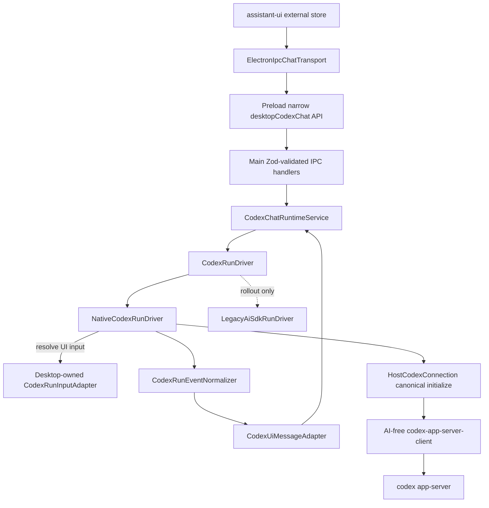

# 参考项目核心 + 当前 UI/安全边界：Codex App Server 原生运行时重构计划

状态：Proposed  
日期：2026-09-03  
范围：`desktop-app/` 与其 vendored TypeScript 包  
明确禁区：不修改 `codex/codex-rs/app-server/`

## Requirements Summary

### 目标

把桌面聊天的核心执行链路从：

```text
assistant-ui
  -> Electron IPC
  -> AI SDK streamText()
  -> ai-sdk-provider-codex-asp
  -> Codex App Server Protocol
```

重构为：

```text
assistant-ui external store
  -> 现有 UIMessageChunk / typed Codex events
  -> 现有 MessagePort + 窄 IPC
  -> Main-owned CodexRunDriver
  -> AI-free codex-app-server-client
  -> codex app-server
```

核心采用参考 Electron 客户端的思路：应用直接拥有 app-server 连接、`thread/start`、`thread/resume`、`turn/start`、通知、server request 与恢复语义；UI、preload 和安全边界则保留当前项目的优势，不照搬参考项目向 renderer 提供的通用协议总线。

### 当前问题与可复用资产

- 当前 main 在 `desktop-app/src/main/codexChatRuntimeService.ts:5-14` 同时依赖 AI SDK 与 provider，在 `desktop-app/src/main/codexChatRuntimeService.ts:2453-2484` 把 `UIMessage` 转成 model messages、组装 `codexCallOptions()` 并调用 `aiStreamText()`。这正是需要移除的中间耦合。
- provider 并非薄适配器：`desktop-app/vendors/ai-sdk-provider-codex-asp/src/model.ts:844-895` 实现 `LanguageModelV3.doStream()` 和事件映射，`desktop-app/vendors/ai-sdk-provider-codex-asp/src/model.ts:1345-1691` 负责 `thread/resume`、`thread/start`、`turn/start`。重构必须迁移这些语义，而不是简单删除目录。
- provider 包的公开面过宽：`desktop-app/vendors/ai-sdk-provider-codex-asp/src/index.ts:13-266` 同时导出连接、transport、history、thread、command、process session、协议类型、事件 mapper、session 和 provider。这些 app-server 基础能力应从 AI SDK provider 中拆出。
- protocol 生成与运行时版本目前没有统一契约：`desktop-app/package.json:93` 精确锁定 `@openai/codex`，`desktop-app/scripts/verify-pinned-codex-cli.mjs:1-22` 只校验本地 CLI 版本，而 `desktop-app/vendors/ai-sdk-provider-codex-asp/package.json:28` 与 `desktop-app/scripts/build-codex-asp-provider.mjs:19` 直接用该 CLI 生成类型。官方 schema 只对应执行生成命令的 Codex 版本，因此迁移后必须用 manifest 同时约束生成器、committed schema 和经过真实二进制证明的 `runtimeVersionSource`，不能假设任意 PATH 中的 app-server 都兼容。当前 generated `InitializeResponse` 只有 `userAgent`、`codexHome`、platform 字段（`desktop-app/vendors/ai-sdk-provider-codex-asp/src/protocol/app-server-protocol/InitializeResponse.ts:6-19`）；旧手写 `CodexInitializeResult.serverInfo`（`desktop-app/vendors/ai-sdk-provider-codex-asp/src/protocol/types.ts:120-125`）不能成为新 core 的版本契约。
- 当前连接层值得直接复用：`desktop-app/vendors/ai-sdk-provider-codex-asp/src/client/app-server-connection.ts:19-27` 已定义“一条物理连接、多条逻辑 transport”，`desktop-app/vendors/ai-sdk-provider-codex-asp/src/client/connection-broker.ts:67-74` 已处理 wire id 与逻辑调用方映射。
- 当前 main 已经拥有可靠的桌面运行时外壳：active run、订阅者、journal、canonical terminal、approval 状态集中在 `desktop-app/src/main/codexChatRuntimeService.ts:143-194`；attach/replay 在 `desktop-app/src/main/codexChatRuntimeService.ts:1067-1182`。这些逻辑保留，不在本次重写。
- 当前输入投影同样不是薄转换：`desktop-app/vendors/ai-sdk-provider-codex-asp/src/utils/prompt-file-resolver.ts:138-443` 负责只取最后一条 user message、文本优先、inline/local/remote image、file/folder mention、composer context、最多三个 task reference 及临时文件清理。native path 必须用 desktop-owned input adapter 显式迁移并差分验证这些语义，不能把 `UIMessage` 直接拼成字符串。
- renderer 已经使用 assistant-ui external store：`desktop-app/src/renderer/src/App.tsx:1062`；消息流由 `desktop-app/src/renderer/src/runtime/ConversationTranscriptController.ts:591-601` 消费 `ReadableStream<UIMessageChunk>`。因此无需照搬参考项目的 renderer runtime。
- 当前安全边界已经是窄接口：`desktop-app/src/shared/codexIpcApi.ts:443-465` 定义有限 stream/control 消息，`desktop-app/src/shared/codexIpcApi.ts:505-548` 校验 start/attach payload，`desktop-app/src/shared/codexIpcApi.ts:699-709` 只暴露明确的 `DesktopCodexChatApi`；preload 在 `desktop-app/src/preload/index.ts:170-195` 只桥接这些入口。
- 旧 metadata 不只存在于 renderer reader：provider 在 `desktop-app/vendors/ai-sdk-provider-codex-asp/src/provider.ts:131-138` 写入 provider identity，per-call contract 在 `desktop-app/vendors/ai-sdk-provider-codex-asp/src/provider-settings.ts:181-186` 绑定 `providerOptions[CODEX_PROVIDER_ID]`，main 还在 `desktop-app/src/main/codexChatRuntimeService.ts:2390-2397` 和 `:2786-2803` 读取旧 key。metadata 迁移必须同时覆盖 producer、main reader、renderer reader 和历史数据。

### 参考项目证据边界

已执行：

```sh
npm --prefix desktop-app run reference:chatgpt:validate -- --root reference-projects/codex-electron-26.818.21641-beautified
```

结果：`valid=true`、`sourceMode=beautified-fallback`、7188/7188 文件通过。归档中没有排版前 raw mirror，所以下列证据只引用可读 bundle 行号，不虚构 raw 行列。

- renderer request client 创建 `{ id, method, params }` 并通过 `mcp-request` 发往宿主：`reference-projects/codex-electron-26.818.21641-beautified/webview/assets/app-initial-DOX-K1rC.js:106340-106426`，SHA256 `3e25e0c6cb4474d93afaff933c9f7473783d45002d0d8c641d0b5015019b13e4`。
- main 接收 renderer 的 `mcp-request`：`reference-projects/codex-electron-26.818.21641-beautified/.vite/build/main-Cwjv9Ibf.js:90145-90154`，SHA256 `f2cc48c767fb95d4f1ed5c9f847deefc65bbbb3e3e0bef4556264a515f70ef3a`。
- main-owned app-server client 直接提供 `listModels()`、`startThread()`、`startTurn()`，并发送 `model/list`、`thread/start`、turn request：`reference-projects/codex-electron-26.818.21641-beautified/.vite/build/src-PzwkD6WC.js:46753-46796`，SHA256 `63a92f6c811355a447bb65029b4963f7552ed31607de88858e494da1c995a4f5`。
- main 路由 app-server server request 并向窗口广播 `mcp-request`：`reference-projects/codex-electron-26.818.21641-beautified/.vite/build/src-PzwkD6WC.js:48572-48630`；通知广播见同文件 `:48794-48810`。

由这些证据可得：参考项目的优势是“应用原生拥有 app-server 协议与运行状态”，不是某个可从 codex-cli import 的 JavaScript 库。本计划只采用这部分核心，不复制其 renderer 通用请求总线。

## Architecture Decision

### 选择：混合架构



| 层 | 最终职责 | 本次处理 |
| --- | --- | --- |
| Renderer | assistant-ui、conversation transcript、审批 UI，只消费 renderer-safe 类型 | 保留；只迁移旧 provider metadata key |
| Preload/shared IPC | 白名单 API、Zod schema、MessagePort | 保留；禁止增加任意 method/params 透传 |
| Main runtime | run admission、UI input 投影、thread/turn 编排、Goal、steer、审批、恢复、journal、terminal | 保留外壳；把内部执行器换成 `CodexRunDriver`，由 desktop-owned adapter 处理 UI 输入 |
| Host connection | 每个 host 的连接生命周期、唯一 initialize、能力协商、connection-global server request | 从 logical client 中上移为 main-owned 单一所有者 |
| `codex-app-server-client` | transport、JSON-RPC、连接复用、typed protocol client、中性 `CodexRunEvent`/normalizer、基础子客户端 | 从 provider 拆成 AI-free 内部包；禁止反向依赖 desktop Main |
| AI SDK provider | 迁移期兼容实现 | 先变薄，再退出 desktop production dependency |
| Codex app-server | 执行基座 | 不修改 |

### 不采用的方案

1. **完整照搬参考项目并把通用 app-server 总线暴露给 renderer**：协议升级方便，但会扩大 renderer 权限面，破坏 `desktop-app/src/shared/codexIpcApi.ts:257` 的 strict request body 与 `:699-709` 的窄 API。
2. **永久保留当前 provider 作为核心**：短期成本最低，但继续让 session、approval、history、transport、protocol 与 ProviderV3 混在一个包里，无法消除当前层级冗余。
3. **把 JSON-RPC 直接堆进 `CodexChatRuntimeService`**：目录更少，但会把协议状态机、桌面编排、journal 和 UI chunk 转换放进同一个大服务；当前该服务已经在 `desktop-app/src/main/codexChatRuntimeService.ts:143-194` 管理大量运行状态，不应继续扩张。
4. **新增独立 sidecar/service 持有 app-server**：可以隔离协议进程，但会形成 Main runtime 与 sidecar 两个本地控制面，使 run admission、approval、journal/replay、凭据和故障恢复跨进程分裂；在当前 Electron Main 已经拥有这些状态的前提下，只增加生命周期、IPC 和恢复复杂度，没有换来明确的安全或复用收益。

### 架构最优性判断

这里的“最优”限定为当前约束下的最佳适配，而不是脱离现有代码资产的理论最少层数。该混合架构同时满足四个不可互换的目标：app-server 协议与连接由 Main 原生拥有；renderer 权限面不扩大；assistant-ui、`UIMessage`、journal/replay 与 canonical terminal 不重写；迁移期可对 legacy/native 做逐事件和逐请求差分。与上述替代方案相比，它没有引入第二控制面，也没有把协议能力泄露给 renderer，新增的 input/output adapter 和 driver seam 都对应真实边界而非装饰层。因此，补齐本计划的输入投影、server request 穷举路由和 initialize 单一所有权后，它是本项目约束下的首选架构。

## Scope and Non-Goals

### In Scope

- 拆出 project-owned 内部包 `desktop-app/vendors/codex-app-server-client/`，建议包名 `@dascowork/codex-app-server-client`。
- 在 main 引入 `CodexRunDriver`、legacy adapter、native driver、input/UI adapter；在 AI-free core 引入中性协议事件类型与 normalizer。
- 将 desktop 非聊天 app-server consumers 从 provider 包迁到新 client 包。当前生产引用点见 `desktop-app/src/main/codexAspProvider.ts:1-12`、`desktop-app/src/main/index.ts:16-20`、`desktop-app/src/main/conversations/AppServerThreadClient.ts:1-10`、`desktop-app/src/main/conversations/ConversationApiService.ts:1-16`、`desktop-app/src/main/composerContext/ComposerContextSearchService.ts:1-7`、`desktop-app/src/main/hosts/CodexHostConnectionRegistry.ts:1`、`desktop-app/src/main/localGit/GitHostRegistry.ts:1-10`、`desktop-app/src/main/terminal/RemoteProcessTerminalBackend.ts:1`。
- 迁移 `CODEX_PROVIDER_ID` metadata 的 renderer 隐式依赖。当前引用见 `desktop-app/src/renderer/src/App.tsx:2733-2760`、`desktop-app/src/renderer/src/runtime/ConversationTranscriptController.ts:17`、`desktop-app/src/renderer/src/lib/toolGroupSummary.ts:117`、`desktop-app/src/renderer/src/components/render-units/renderUnitDetails.tsx:81`。
- 调整 build/type generation、测试和架构文档。

### Non-Goals

- 不修改 `codex/codex-rs/app-server/`。
- 不移除 assistant-ui，不重做 renderer conversation store，不改变 `UIMessage`/`UIMessageChunk` 作为 UI 层数据结构。
- 不开放 `sendAppServerRequest(method: string, params: unknown)`、raw JSON-RPC、完整 model provider config、provider headers 或 API key 给 renderer。
- 不绕过 app-server 直接调用 OpenAI-compatible API、Responses API、第三方模型 SDK 或模型 `fetch` 接口。
- 不在本次迁移顺带重做 conversation sidebar、terminal、local git、plugin center 或 composer context 的产品行为。

## Acceptance Criteria

以下条目全部满足，才视为完成；“native 能跑”不等于迁移完成。

### 架构与依赖

- [ ] `desktop-app/vendors/codex-app-server-client/package.json` 不包含 `ai`、`@ai-sdk/provider`、`@ai-sdk/provider-utils`、React 或 Electron 依赖；`rg -n "from ['\"](ai|@ai-sdk/provider|@ai-sdk/provider-utils|react|electron)['\"]" desktop-app/vendors/codex-app-server-client/src` 无结果。
- [ ] `CodexRunEvent` 与 `CodexRunEventNormalizer` 由 AI-free core 同一边界拥有；core 不 import `desktop-app/src/main`、renderer、shared UI contract。`CodexRunInputAdapter` 与 `CodexUiMessageAdapter` 只在 desktop Main，依赖方向始终为 Main/provider compatibility -> core。
- [ ] `desktop-app/src/main` 的生产代码不再 import/call `streamText`、`convertToModelMessages`、`codexCallOptions`、`LanguageModelV3`、`CodexLanguageModel`；允许继续 import `UIMessage`/`UIMessageChunk` 作为桌面 UI contract。
- [ ] `desktop-app/package.json` 不再把 `@janole/ai-sdk-provider-codex-asp` 作为 production dependency；如保留 vendored provider，其 package tests 能独立运行，且 desktop production source 无 import。
- [ ] `desktop-app/vendors/ai-sdk-provider-codex-asp/src/history-mapper.ts:3-58` 这类 `UIMessage` mapper 不进入 AI-free client 包；它迁到 desktop UI adapter 边界或被等价实现替代。
- [ ] generated app-server protocol 只能在 `codex-app-server-client` 中生成和导出；provider compatibility layer 与 desktop 只能依赖该单一来源，仓库中不存在第二份 generated protocol tree。
- [ ] `desktop-app/vendors/codex-app-server-client/protocol-manifest.json` 是唯一协议兼容清单，至少包含 schema generator 的精确 Codex 版本、generated tree 的确定性 SHA256、支持的 app-server 精确版本列表、必需 initialize capabilities/method 集合，以及 `runtimeVersionSource`、`runtimeVersionParser`、`runtimeVersionEvidence`。版本来源只能是由当前 generated schema 和真实 app-server smoke 证明稳定的同一运行实例证据，例如可验证格式的 `InitializeResponse.userAgent`、对同一 host/已解析精确 executable 的 launch-time `--version` probe，或未来 generated schema 新增的正式字段；不得引用手写旧协议字段。初始支持列表只包含 `desktop-app/package.json`/lockfile 锁定且通过真实二进制契约测试的版本，不使用未经官方保证的宽泛 SemVer range。
- [ ] build/CI 在临时目录用 manifest 指定的 Codex 版本重新执行 `app-server generate-ts`，规范化后与 committed generated tree 做逐文件 diff 并验证 manifest hash；版本、lockfile、生成结果或 hash 任一不一致即非零退出。
- [ ] protocol contract verifier 证明 manifest 的 runtime version 来源可从同一实际启动实例稳定取得并按同一 parser 得到精确版本；缺失、不可解析、来源来自不同 host/executable、parser/evidence hash 不一致均失败。core/native production path 不得 import 或重建 `src/protocol/types.ts` 中的手写 `CodexInitializeResult.serverInfo` 作为兼容依据。
- [ ] `desktop-app/scripts/verify-codex-native-runtime-boundaries.mjs` 是 Phase 8 的权威静态门禁：按生产源码、测试、历史兼容 fixture 分类扫描 import 和禁止字面量，输出机器可读报告并在任何意外命中、重复 generated protocol tree、core 反向依赖、缺失或过期 allowlist 项时非零退出。allowlist 只能使用精确文件 + rule id + 期望命中数 + 原因，禁止目录级/glob/任意 regex 豁免。
- [ ] Phase 0 ADR 记录不可变的 migration base SHA；`git diff --name-only <migration-base-sha>...HEAD -- codex/codex-rs/app-server` 与工作区 diff 均无输出，证明整个迁移序列而不只是当前未提交改动没有修改 app-server。

### 安全边界

- [ ] `DesktopCodexChatApi` 仍只包含 `desktop-app/src/shared/codexIpcApi.ts:699-709` 这类明确业务方法；生产 schema/type 中不存在 renderer 可控的 `method: string` + `params: unknown` 通用 app-server 请求。
- [ ] `codexChatRequestBodySchema` 继续 `.strict()`；包含 `{ method: 'thread/start', params: {} }`、完整 sandbox policy、custom model provider 或 provider headers 的 renderer payload 在 shared/main IPC tests 中均被拒绝。当前 strict 边界见 `desktop-app/src/shared/codexIpcApi.ts:244-258`。
- [ ] `CodexServerRequestRouter` 对 generated `ServerRequest` 联合类型做穷举 switch 并以 `assertNever` 保证编译期完整：command、file change、tool user input、permissions、MCP elicitation 五类交互请求经 `CodexApprovalBroker` 的 renderer-safe 参数转换；`item/tool/call` 只进入 Main dynamic-tool registry；`account/chatgptAuthTokens/refresh`、`attestation/generate`、`currentTime/read` 由 Host connection 的 main-only service 处理或返回确定性的 typed unsupported error；`applyPatchApproval`、`execCommandApproval` 明确映射或 fail-closed。当前完整联合类型见 `desktop-app/vendors/ai-sdk-provider-codex-asp/src/protocol/app-server-protocol/ServerRequest.ts:20`，安全转换入口见 `desktop-app/src/main/codexApprovalBroker.ts:59-110`。
- [ ] raw wire 上出现 generated union 之外的未来 server request 时返回协议错误并记录脱敏诊断，不挂起连接；任何 raw `method/params`、auth refresh token、attestation payload 或完整 dynamic-tool args 都不进入 renderer。`serverRequest/resolved` 后对应 pending approval/input UI 必须清除。
- [ ] custom provider 的 API key/header 只出现在 main/native driver 到 app-server 的内存/stdio 边界；结构化日志和 renderer event fixtures 中不存在这些值。

### 协议与运行行为

- [ ] `HostCodexConnection` 是每个 host/connection generation 唯一的 initialize 所有者：使用固定 `clientInfo` 和 chat/history/catalog 所需能力的显式并集完成一次 `initialize/initialized` 后才发放 logical client lease；业务 logical client 不得自行发送或覆盖 initialize。不同 consumer 启动顺序、并发首用与 transport generation 重建都得到同一握手结果；不兼容能力请求在启动期确定性失败。当前 first-caller-wins 风险锚点见 `desktop-app/vendors/ai-sdk-provider-codex-asp/src/client/connection-broker.ts:312-338`。
- [ ] 每个 connection generation 在任何 `thread/*`/`turn/*` 请求发出前，`HostCodexConnection` 按 protocol manifest 声明的 `runtimeVersionSource` 和 parser 取得同一 local/remote 启动实例的精确版本，并确认 canonical initialize 使用的 capabilities 与 manifest 一致；不假设 server 会动态枚举完整 method 集合。来源缺失、不可解析、不能证明来自同一 host/executable，或版本不在支持清单时，必须关闭该 generation，返回 renderer-safe `codex_app_server_version_unsupported`（包含 expected/actual/source category，不含路径、环境或凭据），且不得自动切 legacy、不得尝试 `thread/start`。method/field 兼容性由该精确版本的 generated schema 和真实二进制契约测试证明；只有为新增版本跑完 initialize、model/list、thread/start、turn/start、stream、server-request、interrupt/recovery 与 packaged smoke 后，才允许更新支持清单。
- [ ] 新线程严格产生一次 `thread/start`、一次 `turn/start`；正常继续对话为 `thread/resume -> turn/start`。renderer reload/in-memory reattach 只做 `runId + afterSequence` 订阅与 replay，产生 **零次** app-server 请求；仅 app-server transport/process recovery 执行 `thread/resume` 并产生 **零次** `turn/start`。当前对照测试见 `desktop-app/vendors/ai-sdk-provider-codex-asp/tests/model.stream.test.ts:962-1044`、`:1271-1319`、`:2170-2219`。
- [ ] 同一 host 上 chat/history/catalog 的并发 logical clients 共享一条物理连接；请求 wire id 不冲突，run-owned server request 按 thread/turn owner 回到正确 run，connection-global request 不依赖 thread/turn owner。当前 broker 语义见 `desktop-app/vendors/ai-sdk-provider-codex-asp/src/client/connection-broker.ts:67-74`、`:170-193`、`:524-550`。
- [ ] desktop-owned `CodexRunInputAdapter` 把 `UIMessage` 和 composer context 投影为 typed app-server `UserInput[]`，保持 legacy 行为：fresh/resume 都只取最后一条 user message，文本位于图片前；local/remote/inline image、inline text file、file/folder mention、skill/mention context、最多三个非当前 task reference、developer instructions、Goal 首轮与 follow-up/steer 附件、临时文件 cleanup 均有 golden fixture。legacy/native 对同一输入生成的 `thread/start`/`turn/start` 稳定字段必须相等，差异只能进入逐字段 allowlist。
- [ ] `CodexRunEventNormalizer -> CodexUiMessageAdapter` 对 golden fixtures 输出与 legacy path 等价的有序 `UIMessageChunk`：text、reasoning、command/tool、file change、MCP、plan、diff、usage、source、completed/failed/interrupted terminal 全覆盖；允许差异必须记录在 fixture allowlist，不能用全局 snapshot 更新掩盖差异。
- [ ] renderer detach 只移除 subscriber，不中断 authoritative run；reload 后可按 `runId + afterSequence` attach/replay，journal overflow 返回 `resync-required`。当前契约见 `desktop-app/src/main/codexChatRuntimeService.ts:1059-1182` 和 `desktop-app/src/preload/chatStreamBridge.ts:116-138`。
- [ ] stop/interrupt、transport disconnect、active turn missing、approval pending、重复 notification、notification 早于 request response 等故障场景只产生一个 canonical terminal，不重复启动 turn。当前 transport recovery 测试锚点见 `desktop-app/src/main/codexChatRuntimeService.test.ts:1767-1961`。
- [ ] Goal 新建、已有 Goal control、自动多 turn、Goal clear/complete、steer/follow-up 都保持同一 thread/run 所有权语义；现有 provider/main/renderer 测试锚点见 `desktop-app/vendors/ai-sdk-provider-codex-asp/tests/model.stream.test.ts:1119-1271`、`desktop-app/src/main/codexChatRuntimeService.test.ts:690-851`、`desktop-app/src/renderer/src/runtime/ConversationTranscriptController.test.ts:86-136`。
- [ ] commit subject 生成不再走 `this.streamText()`（当前路径见 `desktop-app/src/main/codexChatRuntimeService.ts:525-536`），改用隔离的 ephemeral native run；它不进入 conversation active-run map、不触发工具/审批、不留下 sidebar thread，并继续限制为单行且不超过 72 个字符。
- [ ] model list、cwd、sandbox/approval mode、collaboration mode、MCP、workspace roots 和 admin custom model provider 映射通过 typed native input 进入 `thread/start`/`turn/start`；现有 provider 对照测试见 `desktop-app/vendors/ai-sdk-provider-codex-asp/tests/model.stream.test.ts:2050-2128`、`:2707-3022`。

### UI 与迁移完成度

- [ ] `useExternalStoreRuntime` 与 `readUIMessageStream` 路径保留，`desktop-app/src/renderer/src/App.tsx:1062` 和 `desktop-app/src/renderer/src/runtime/ConversationTranscriptController.ts:591-601` 无需改为参考项目的自研 store。
- [ ] 新增 shared `CodexMessageMetadata` 与稳定 key；过渡阶段 adapter 同时写新旧 key、renderer 同时读新旧 key，迁移完成后生产代码不再硬编码 `@janole/ai-sdk-provider-codex-asp`。
- [ ] metadata 迁移测试覆盖 producer、main、renderer 和历史 fallback：`desktop-app/src/main/codexChatRuntimeService.test.ts:2028` 一类 main fixture、`desktop-app/src/renderer/src/lib/assistantRenderUnits.test.ts:1978-1985`、`desktop-app/src/renderer/src/App.test.tsx:4838`、`desktop-app/src/renderer/src/runtime/ConversationChatRegistry.test.ts:1456` 都改用 shared builder/parser；仅专门的旧历史兼容 fixture 可保留旧字面量。
- [ ] Main-only rollout selector 在 run 创建时冻结；运行中的 turn 不允许从 legacy 切到 native，也不允许 native 失败后自动重发到 legacy。回滚只影响后续新 run 或重启后的 run，避免重复执行命令/文件修改。
- [ ] native 与 legacy 各执行 20 次相同的 deterministic fake-app-server 会话；native 的 p95 first-chunk latency 不超过 legacy p95 的 110%，总 chunk 数、顺序、terminal outcome 完全一致。现有性能入口见 `desktop-app/package.json:20`。
- [ ] Phase 0 已知 provider Goal/session timeout（`desktop-app/vendors/ai-sdk-provider-codex-asp/tests/provider.test.ts:484`）必须修成确定性测试，并连续两次全绿后才可作为迁移基线；不得删除该行为断言来“修复”门禁。

## Implementation Steps

### Phase 0 — 固化基线与迁移 ADR（S）

目标：在改结构前把现有行为变成可执行契约。

工作项：

1. 在本计划或独立 ADR 中冻结上述混合架构决策、non-goals、回滚原则和 package ownership。
2. 修复 `desktop-app/vendors/ai-sdk-provider-codex-asp/tests/provider.test.ts:484` 的 Goal/session timeout，使 provider suite 连续两次通过；保留原语义断言。
3. 在 ADR 中记录 migration base SHA，后续每个 PR 和最终门禁均从该基线检查 `codex/codex-rs/app-server/`，不能用当前工作区干净代替全迁移序列未修改的证明。
4. 在 `desktop-app/src/main/codexChatRuntimeService.test.ts` 补齐 new/resume、renderer-only reattach、transport recovery active resume、canonical terminal、approval settlement、Goal/steer、并发 isolation 的 characterization cases。已有高风险测试锚点包括 `:1010`、`:1767`、`:3282`、`:5018`。
5. 从 `desktop-app/vendors/ai-sdk-provider-codex-asp/tests/event-mapper.test.ts` 与 `tests/model.stream.test.ts` 提取版本化 golden fixtures；fixture 保存 app-server inbound 序列、预期 domain events、预期 `UIMessageChunk` 和 terminal。
6. 从 `model.stream.test.ts` 和 `src/utils/prompt-file-resolver.ts:138-443` 提取版本化 outbound fixtures，保存 UI messages/context、预期 `thread/start`/`turn/start` typed params、临时文件生命周期；至少覆盖 fresh/resume、local/remote/inline image、inline text、file/folder、skill/mention、task references、Goal、follow-up/steer。
7. 为当前 generated `ServerRequest` 的全部 method 建立 handler matrix fixture，记录 owner 类型（run/connection）、允许跨 renderer 的 DTO、成功响应与 fail-closed 响应。
8. 冻结协议兼容政策：记录当前 `@openai/codex` package/lockfile 精确版本、generated tree hash、候选 `runtimeVersionSource` 及证明要求、版本校验时点、renderer-safe 不兼容错误和“新增支持版本必须先通过真实二进制契约矩阵”的规则；明确 generated `InitializeResponse` 当前没有 `serverInfo.version`，初始不声明未经验证的版本来源或跨版本兼容。
9. 冻结最终静态门禁 verifier 的负向 fixture 清单与期望结果：生产 import provider、Main 调用 `streamText`、renderer raw method/params、core import Main/UI、第二份 generated tree、宽泛/过期 allowlist 都必须失败；精确历史兼容 fixture 才能通过。Phase 0 只保存输入/期望，不新增尚未实现 verifier 的强制执行测试；Phase 1 再实现脚本和这些 Node tests 并要求全绿。
10. 固化旧 metadata 的完整 producer/consumer 行为：provider identity、providerOptions、main duration/thread/turn readers、renderer message phase/tool/render-unit readers，以及历史 message fallback。
11. 为当前 `desktop-app/src/shared/codexIpcApi.ts:244-258` 增加负向安全测试：未知字段、raw method/params、privileged config 均拒绝。
12. 用 deterministic fake app-server 建立 legacy 性能基线，记录 N=20 的 first-chunk p50/p95、总时长、chunk 数和内存峰值；沿用 `desktop-app/package.json:20` 的性能测试入口。

退出门禁：只改测试、fixture、ADR；production runtime 行为不变；provider/desktop targeted suites连续两次全绿。

### Phase 1 — 拆出 AI-free `codex-app-server-client`（M）

目标：先移动基础设施，不改聊天执行路径。

新建：

- `desktop-app/vendors/codex-app-server-client/package.json`
- `desktop-app/vendors/codex-app-server-client/src/index.ts`
- `desktop-app/vendors/codex-app-server-client/protocol-manifest.json`
- `desktop-app/scripts/verify-codex-app-server-protocol-contract.mjs`
- `desktop-app/scripts/verify-codex-native-runtime-boundaries.mjs`
- `desktop-app/scripts/tests/verify-codex-app-server-protocol-contract.node-test.mjs`
- `desktop-app/scripts/tests/verify-codex-native-runtime-boundaries.node-test.mjs`
- 对应 `tsconfig.json`、build、lint、test 配置

迁移原则：

1. 原样迁移 `src/client/*`、generated `src/protocol/app-server-protocol/*`、纯协议 errors/types；优先保持 `AppServerClient`、`CodexAppServerConnection`、`CodexAppServerConnectionBroker` 的行为不变。当前 API 锚点见 `desktop-app/vendors/ai-sdk-provider-codex-asp/src/client/app-server-client.ts:71-292`。
2. 迁移 AI-free 的 `history-client.ts`、`thread-client.ts`、`command-client.ts`、`context-catalog-client.ts`、`process-session-client.ts`；逐文件做 import-boundary 检查，不把 `UIMessage` mapper 或 ProviderV3 settings 搬入 core。
3. `approvals.ts`、dynamic tools、lifecycle helpers 若含 AI SDK 类型，先拆出纯协议 dispatcher/DTO，再由 provider wrapper 和 main policy 层各自适配，禁止把 AI SDK 类型带进 core。
4. 协议类型只生成一份。把 `desktop-app/vendors/ai-sdk-provider-codex-asp/package.json:28` 的 `codex app-server generate-ts` 入口迁到 core；把 `desktop-app/scripts/build-codex-asp-provider.mjs:1-36` 重命名/改造成调用 `verify-codex-app-server-protocol-contract.mjs`：读取 protocol manifest 与 package/lockfile，离线确认精确 CLI 版本，在临时目录 generate，规范化并与 committed tree 做逐文件 diff，验证确定性 tree hash，并用真实 app-server fixture 验证 `runtimeVersionSource`/parser/evidence 后再 build core/compatibility provider。
5. provider 改为依赖 `@dascowork/codex-app-server-client`，删除 provider 内第二份 client/transport/protocol 源码，确保不是 copy-and-diverge。
6. 实现 `verify-codex-native-runtime-boundaries.mjs` 及其 Node tests。verifier 显式枚举 production roots 和测试/fixture 排除规则，不把 test 文件混入“生产零命中”；每个 allowlist entry 必须精确匹配预期次数，零命中也视为 stale allowlist 并失败。至少检查 provider/AI SDK import、Main 旧调用、renderer 通用 method/params、core 的 AI/UI/Electron/Main 反向依赖、generated protocol tree 唯一性、core/native 对旧手写 `CodexInitializeResult.serverInfo` 的依赖，以及 provider metadata 历史兼容范围。

退出门禁：legacy desktop chat 仍走 `streamText()`；core 无 AI/UI/Electron 依赖；protocol contract verifier、runtime-boundary verifier 自身正负测试、connection/client 原测试和 provider suite 全绿；使用错误 CLI 版本、篡改 generated 文件或新增第二份 generated tree 的 fixture 均被拒绝。

### Phase 2 — 迁移非聊天 consumers（M）

目标：让 app-server 基础能力先从 provider 命名中脱离，缩小后续切换面。

1. 将 `desktop-app/src/main/index.ts:16-20`、`conversations/AppServerThreadClient.ts:1-10`、`conversations/ConversationApiService.ts:1-16`、`composerContext/ComposerContextSearchService.ts:1-7`、`hosts/CodexHostConnectionRegistry.ts:1`、`localGit/GitHostRegistry.ts:1-10`、`terminal/RemoteProcessTerminalBackend.ts:1` 改为从 core 包导入。
2. 把 `desktop-app/vendors/ai-sdk-provider-codex-asp/src/history-mapper.ts:3-58` 移到 desktop-owned adapter，例如 `desktop-app/src/main/conversations/CodexHistoryUiMessageMapper.ts`；它可以继续依赖 `ai`，但不能反向污染 core。
3. 将 `desktop-app/src/main/codexAspProvider.ts:44-118` 中的 launch/env 脱敏、NO_PROXY、默认 cwd/sandbox/approval/debug policy 拆成 `codexAppServerConnection.ts` 与 `codexRunPolicy.ts`；connection factory 依赖 core，legacy provider preset 暂时依赖这些共享 policy。
4. 新增 `HostCodexConnection`/initialize policy：按 host 与连接配置持有物理 connection generation，固定 `clientInfo`，显式声明 chat/history/catalog 能力并集，在发放 logical client lease 前完成一次 canonical initialize；logical clients 不再携带自己的 initialize payload。
5. 新增 `codexAppServerVersionPolicy.ts`（或同等 main-owned 模块），严格执行 manifest 已由 Phase 1 真实二进制 fixture 证明的 `runtimeVersionSource`/parser。若来源为 `InitializeResponse.userAgent`，只读取 generated 字段；若为 launch probe，必须由 host connection factory 对同一 host 和已解析精确 executable 执行并把证据绑定到该 generation；未来正式 generated version 字段只能在重新生成协议并更新 manifest 后使用。不得回退到旧手写 `CodexInitializeResult.serverInfo`。
6. 在 `desktop-app/src/main/index.ts:168-213` 保持 sidebar/history/context 与 chat 复用 `HostCodexConnection`；远程 host 通过 host-keyed registry 获得独立连接，不能把 local/remote 请求混到同一 broker。用 consumer 启动顺序排列、并发首用、generation restart、不兼容 capability request，以及 supported/missing/unparseable/lower/higher/cross-host evidence version 测试消除 first-writer-wins 和版本漂移。

退出门禁：除 `codexChatRuntimeService`、legacy driver 和 provider compatibility tests 外，desktop production source 不再 import `@janole/ai-sdk-provider-codex-asp`；Host connection initialize 启动顺序/并发/generation/version-policy tests 全绿；不兼容版本在零个 thread/turn 请求后关闭；产品行为不变。

### Phase 3 — 在 Main 建立 `CodexRunDriver` seam（M）

目标：先把 `CodexChatRuntimeService` 从“依赖 streamText”改成“依赖 run driver”，默认行为仍为 legacy。

新建建议：

- `desktop-app/src/main/codexRun/CodexRunDriver.ts`
- `desktop-app/src/main/codexRun/CodexRunTypes.ts`
- `desktop-app/src/main/codexRun/LegacyAiSdkRunDriver.ts`
- `desktop-app/src/main/codexRun/CodexRunPolicy.ts`
- `desktop-app/src/main/codexRun/CodexRunInputAdapter.ts`
- `desktop-app/vendors/codex-app-server-client/src/run-events/CodexRunEvent.ts`

接口至少表达：

- `startRun(request) -> { events: AsyncIterable<CodexRunEvent>, session, interrupt }`
- `CodexRunRequest`：desktop 高层请求；迁移期允许携带现有 `UIMessage` contract，但不包含 raw JSON-RPC。
- `ResolvedCodexRunInput`：由 `CodexRunInputAdapter` 产生的 AI-free、protocol-ready 输入，表达 new/resume/recovery、typed `UserInput[]`、developer instructions、model、cwd/workspace roots、collaboration、approval/sandbox、Goal、MCP/custom provider。
- core-owned `CodexRunEvent`：thread/turn binding、item/delta、plan/diff、settings/goal、usage、transport recovery、terminal；不得包含 `LanguageModelV3StreamPart`、`UIMessageChunk` 或 raw renderer IPC。Main 的 `CodexRunTypes.ts` 只拥有 request/session 等 desktop 类型并从 core import event，core 不得 import Main。
- `CodexRunSession`：只暴露 `steer`、`interrupt`、Goal get/set/clear 等 main 需要的窄控制能力，替代当前 provider session façade。

实施：

1. 用 `LegacyAiSdkRunDriver` 包装 `desktop-app/src/main/codexChatRuntimeService.ts:2400-2495` 的现有逻辑。
2. `CodexChatRuntimeService` constructor 从 `streamText?: StreamTextLike` 迁为 `runDriverFactory`，先在 tests 中兼容旧 fake，再逐步删除 `StreamTextLike`。
3. 保持 active run、journal、subscriber、terminal、approval broker 在 service；driver 只负责一次 Codex run 的协议生命周期，避免形成第二份 authoritative run registry。
4. 实现 desktop-owned `CodexRunInputAdapter`；它可以依赖 `UIMessage` 和 desktop task/context service，但不得进入 AI-free core。迁移 `PromptFileResolver` 的可观察行为和 cleanup 语义，legacy path 在双栈期保持原实现作为差分 oracle，Phase 8 随 provider 删除；任何临时双实现都由 Phase 0 outbound golden fixtures 锁定，禁止无 fixture 的单边行为修改。

退出门禁：默认仍是 legacy；现有 main/preload/renderer tests 无行为差异；`CodexChatRuntimeService` 已不直接组装 provider options；input adapter 对 Phase 0 outbound golden fixtures 全等且 cleanup tests 全绿。

### Phase 4 — 抽出中性事件 normalizer 与 UI adapter（L）

目标：复用现有 mapper 状态机，但切断它与 ProviderV3 的绑定。

新建建议：

- `desktop-app/vendors/codex-app-server-client/src/run-events/CodexRunEventNormalizer.ts`
- `desktop-app/src/main/codexRun/CodexUiMessageAdapter.ts`
- `desktop-app/src/shared/codexMessageMetadata.ts`

实施：

1. 从 `desktop-app/vendors/ai-sdk-provider-codex-asp/src/protocol/event-mapper.ts:289-360` 拆出纯 `app-server notification -> core-owned CodexRunEvent[]` 状态机；保留 item 去重、open tool closure、usage、terminal、source item id、turn diff 等逻辑，禁止为复用而让 core import desktop 类型。
2. legacy provider mapper 变成 `CodexRunEvent -> LanguageModelV3StreamPart` 的薄 wrapper；native UI adapter 变成 `CodexRunEvent -> UIMessageChunk/CodexChatStreamEvent`。迁移期两条路径消费同一 normalizer，减少双实现漂移。
3. 建立 differential harness：同一 inbound fixture 同时通过 legacy 和 native adapter，比较稳定字段的顺序和值；动态 id/time 只允许在明确字段级 normalizer 中归一化。
4. 新增稳定 metadata contract，例如 `CODEX_MESSAGE_METADATA_KEY = 'dascowork.codex'`。此阶段 adapter 双写新旧 key，main/renderer helpers 双读；不在多个组件继续复制 key/parse 逻辑。旧 producer/reader 清单至少包括 `desktop-app/vendors/ai-sdk-provider-codex-asp/src/provider.ts:131-138`、`provider-settings.ts:181-186`、`desktop-app/src/main/codexChatRuntimeService.ts:2390-2397`、`:2786-2803` 和 Scope 中四个 renderer reader。

退出门禁：golden/differential cases 全等；renderer transcript/render-unit tests 不改期望语义；provider mapper 已变薄且仍通过原 tests。

### Phase 5 — 实现 `NativeCodexRunDriver`（L，关键路径）

目标：直接通过 core client 驱动 app-server，不经过 `LanguageModelV3`/`streamText()`。

新建建议：

- `desktop-app/src/main/codexRun/NativeCodexRunDriver.ts`
- `desktop-app/src/main/codexRun/CodexServerRequestRouter.ts`
- `desktop-app/src/main/codexRun/CodexTextGenerationService.ts`

按以下顺序实现并逐项过门禁：

1. 从 `HostCodexConnection` 获取已经 canonical-initialized 的 lease；native driver 不构造或发送 initialize。先注册 notification、run-owned server request 与 connection-global request listener，再发 start 请求，处理 notification 早于 response。
2. new thread：`thread/start -> bind owner -> turn/start`；必须等待 thread binding/project persistence 回调完成后才允许首个 turn。
3. normal resume：`thread/resume -> turn/start`；transport/process recovery 的 active resume：`thread/resume` 后订阅现有 turn，禁止 `turn/start`；renderer reload/reattach 只走 runtime journal subscription，禁止触发 driver/app-server 请求。
4. 调用 `CodexRunInputAdapter` 生成 `ResolvedCodexRunInput`，把 typed `UserInput[]`、cwd、workspace roots、approval/sandbox、collaboration mode、MCP、custom model provider 和 developer instructions 映射进 `thread/start`/`turn/start`；复用 Phase 2 的 policy/config builder，并用 legacy/native outbound differential harness 比较稳定字段。
5. `CodexServerRequestRouter` 穷举 generated `ServerRequest`：五类交互请求进入 `CodexApprovalBroker`；dynamic tool 进入 Main registry；auth refresh/attestation/current time 进入 Host connection service 或 typed unsupported；两类 legacy approval 明确映射或 fail-closed。run-owned 请求才查询 thread/turn owner，connection-global 请求不得误报 unknown owner；未知未来 method 返回协议错误并记录脱敏诊断。
6. 支持 session `steer`、interrupt、Goal get/set/clear、Goal continuous、compaction、transport reconnect 和 active-turn recovery。
7. 用 `CodexTextGenerationService` 替代 `desktop-app/src/main/codexChatRuntimeService.ts:525-536` 的 commit subject AI SDK 调用；使用 ephemeral、无工具、无审批的隔离 run。
8. 每个 run 的 `driverKind`、host、run/thread/turn id、sequence、terminal source 写入结构化脱敏日志；不得记录 prompt、API key、provider headers 或完整 tool args。

退出门禁：native driver 在 unit/integration tests 中覆盖全部协议与故障矩阵，但 production default 仍不切换。

### Phase 6 — 通过现有 IPC 集成并双路径验证（M）

目标：让 native path 完整穿过 renderer -> preload -> main -> app-server fake，同时保持即时回滚能力。

1. 在 main 增加临时 selector `CODEX_DESKTOP_RUN_DRIVER=legacy|native`，默认先为 `legacy`；它只在 main 读取，并加入 `desktop-app/src/main/codexAspProvider.ts:164-180` 一类 host-control env 过滤，不能传入 app-server 子进程。
2. run 创建时冻结 driver；活动 run 的 recovery、reattach、steer、interrupt 永远回到原 driver。native 失败不能自动调用 legacy 重发，因为 turn 可能已执行副作用。
3. 两条 driver 都进入现有 `postStreamEvent()`、journal、canonical terminal 和 attach/replay 路径；不改 `desktop-app/src/preload/index.ts:170-195` 与 `desktop-app/src/shared/codexIpcApi.ts:443-465` 的 wire contract。
4. 扩展 `CODEX_APP_SERVER_BIN` fake，覆盖早到 notification、partial stream 后断线、active turn missing、重复 lifecycle、unknown run owner、全部 generated ServerRequest method、pending approval、renderer reload、Goal multi-turn、并发 conversations、不同 consumer initialize 顺序与 connection generation 重建，以及 runtime version evidence 的 supported/missing/unparseable/lower/higher/cross-host cases。fake 只证明拒绝/路由逻辑；版本来源格式和支持清单中的每个版本还必须跑真实 `codex app-server` 契约 smoke。
5. 用同一 E2E case 分别跑 legacy/native；差异报告必须为零或只有 Phase 4 allowlist 中的字段。

退出门禁：native 通过全部 targeted unit/integration、`test:e2e:stability`、dev LLM smoke 和性能预算；selector 回滚演练证明只影响新 run。

### Phase 7 — 切换默认、迁移 metadata、观察一版（M）

目标：生产默认使用 native，但暂不立刻删除 legacy，以便低风险回退。

1. 将 selector 默认值改为 `native`；legacy 仅作为 main-only rollback path。
2. renderer metadata readers 全部改用 `desktop-app/src/shared/codexMessageMetadata.ts`；先新 key 优先、旧 key fallback。确认历史消息和恢复 snapshot 仍能读取旧 key。
3. native 默认通过一个完整发布候选周期或约定观察窗口；统计 run start failure、recovery、unknown-owner、approval timeout、duplicate terminal 和 first-chunk latency。阈值以 Phase 0 baseline 为准：错误率不高于 legacy，p95 first chunk 不超过 110%。
4. 发现严重问题时只切回后续新 run；不在运行中换 driver。

退出门禁：native 默认的 full suite、E2E、packaged smoke 全绿；观察窗口内无超阈值回归；旧 metadata history 兼容测试通过。

### Phase 8 — 删除 desktop provider 路径与清理（S/M）

目标：完成去层，而不是永久留下“双栈”。

1. 删除 `LegacyAiSdkRunDriver`、selector、`defaultStreamText`、`StreamTextLike`、`codexCallOptions`、ProviderV3 imports，以及 `desktop-app/src/main/codexChatRuntimeService.ts:2788-2800` 的旧 provider metadata 提取逻辑。
2. 移除 `desktop-app/package.json:58` 的 provider production dependency；保留 `ai`，因为 shared/renderer 仍使用 `UIMessage`、`UIMessageChunk` 和 `readUIMessageStream`，见 `desktop-app/src/shared/codexIpcApi.ts:1` 与 `desktop-app/src/renderer/src/runtime/ConversationTranscriptController.ts:1-6`。
3. 旧 provider 若无仓库外明确 consumer，删除 vendored package；若有明确 consumer，只保留薄 compatibility wrapper，并用独立 package CI 证明其不是 desktop runtime 依赖。
4. 删除 provider ID 双写，新 metadata key 成为唯一写入；读旧 key 仅保留在历史兼容 parser，并用迁移测试约束。
5. 全仓迁移测试 imports/fixtures：`desktop-app/src/main/conversations/AppServerThreadClient.test.ts:3`、`main/localGit/GitHostRegistry.test.ts:3`、`main/composerContext/ComposerContextSearchService.test.ts:3` 改用 core types；`renderer/src/lib/assistantRenderUnits.test.ts:6`、`renderer/src/App.test.tsx:4838`、`renderer/src/runtime/ConversationChatRegistry.test.ts:1456` 和 `main/codexChatRuntimeService.test.ts:8` 改用 core/shared metadata helpers。最终 provider 字面量只允许出现在明确命名的 legacy-history compatibility fixture。
6. 删除确认无引用的 provider `src/types.ts`、`src/stream.ts` 等脚手架；是否删除 `@assistant-ui/react-ai-sdk` 必须以 `rg` 无生产/测试引用为前提，不能误删 `ai`。
7. 将 `desktop-app/scripts/build-codex-asp-provider.mjs` 改名为 core runtime build 脚本，更新 `desktop-app/package.json:30-34` 的 pretest/pretypecheck/prestart/predev。
8. 把最终 raw `rg` 检查替换为 `verify-codex-native-runtime-boundaries.mjs` 权威门禁；生成 JSON 报告保存为 CI artifact。保留 raw `rg` 只作诊断，不允许用人工解释覆盖 verifier 失败；历史兼容 allowlist 必须仍满足精确路径、rule id、count 和 reason。
9. 更新 `AGENTS.md`、`docs/codex-app-server-official-notes.md`、`docs/ai-sdk-provider-codex-asp-api.md`（归档/迁移说明）与新的架构 ADR，明确 app-server-client 是 Electron 客户端自有实现，不是 codex-cli 附带 JS 库，并记录 protocol manifest 的升级流程和不兼容错误处理。

退出门禁：所有 Acceptance Criteria 满足；desktop production graph 无 provider；只保留一套 app-server connection/protocol/runtime ownership。

## PR Sequence and Stop Gates

| PR | 内容 | 合并门禁 |
| --- | --- | --- |
| 1 | Phase 0：基线、fixture、安全负测、ADR | production diff 为零；两次全绿 |
| 2 | Phase 1：AI-free core、protocol manifest/contract verifier、boundary verifier，provider 改依赖 core | schema 临时重生成全等；verifier 正负测试、core/provider/Desktop QA 全绿 |
| 3 | Phase 2-3：非聊天 imports + Host connection/version policy + input adapter + `CodexRunDriver`/legacy seam | initialize/version 矩阵、outbound fixtures、desktop full test 全绿；默认行为不变 |
| 4 | Phase 4：neutral normalizer + UI adapter + metadata 双读写 | differential fixtures 全等 |
| 5 | Phase 5：native driver + exhaustive server request router，仅 test/dev 可用 | outbound differential、generated request matrix、unit/integration/fault matrix 全绿 |
| 6 | Phase 6：现有 IPC 集成、真实 supported-version contract smoke 与双路径 E2E | version matrix、stability/dev-LLM/performance 门禁通过 |
| 7 | Phase 7：native 默认 + rollback observation | 观察窗口指标不过线则回退新 run 默认值 |
| 8 | Phase 8：删除 legacy/provider、文档与依赖清理 | protocol/boundary verifier、full QA、packaged smoke 全绿 |

不得为了赶进度把 PR 4-8 合成一次大切换。任一 PR 的退出门禁失败，就停在该阶段修复；不允许靠 renderer API 扩权或 active-run 自动 fallback 绕过问题。

## Test and Verification Strategy

### Unit

- Core client：request/response、timeout、transport close、pending drain、wire id、owner routing、shutdown lease。基于现有 `desktop-app/vendors/ai-sdk-provider-codex-asp/src/client/app-server-client.ts:71-292` 和 connection/broker tests 迁移。
- Host connection：唯一 canonical initialize、固定 clientInfo/capability union、chat/history/catalog 启动顺序排列、并发首用、generation restart、不兼容 capability 拒绝。
- Version policy：manifest 支持、runtime source 缺失/不可解析、低于/高于支持清单、cross-host/executable evidence、local/remote 一致性、零 thread/turn before reject、renderer-safe error、禁止 legacy fallback；旧手写 `CodexInitializeResult.serverInfo` 不得进入 core/native。
- Static verifier：每条禁止规则至少一个 fail fixture；精确 allowlist pass、过期 allowlist fail、命中数变化 fail、目录/glob 豁免 fail、第二份 generated tree fail、机器可读报告 schema 固定。
- Input adapter：last-user-only、text-before-images、local/remote/inline image、inline text、file/folder、skill/mention、task reference limit/load failure、developer instructions、Goal/follow-up/steer attachments、cleanup；legacy/native outbound stable fields 全等。
- Normalizer/adapter：所有 item/delta/tool/source/usage/terminal fixture；来源为 `desktop-app/vendors/ai-sdk-provider-codex-asp/tests/event-mapper.test.ts`。
- Server request router：generated union 每个 method 都有成功或 typed fail-closed case，`assertNever` 编译期穷举；未知未来 method、未知 run owner、connection-global 无 owner、`serverRequest/resolved` 都有测试。
- Native driver：new/resume/transport active recovery、renderer-only reattach、Goal、steer、interrupt、custom provider、commit title、server request。
- Main runtime：复用并扩展 `desktop-app/src/main/codexChatRuntimeService.test.ts` 的 journal、recovery、canonical terminal、approval、concurrency 测试。
- Security：`desktop-app/src/shared/codexIpcApi.test.ts`、`desktop-app/src/preload/chatStreamBridge.test.ts` 验证 strict payload 和窄 API。

### Integration / Fault Injection

必须无固定 sleep，使用可控 promise/barrier 驱动以下顺序：

1. `turn/started` 早于 `turn/start` response。
2. partial text/reasoning/tool 后 transport exit，再 active resume。
3. recovery 时 app-server 无 active turn，最终为 interrupted。
4. duplicate `item/completed` / `turn/completed`，只输出一次 terminal。
5. 未知 thread/turn owner 的 run-owned server request；connection-global request 在无 owner 时仍由 Host connection 正确响应。
6. renderer detach 后 approval 到达，再 attach/replay。
7. stop 在 thread id/turn id 可用前到达，id 可用后只 interrupt 一次。
8. 两个 conversation 共用物理连接且事件不串流；chat/history/catalog 任意启动顺序只发送一次 canonical initialize。
9. Goal mutation 成功后 stream failure，Goal 状态与 terminal 一致。
10. commit title ephemeral run 不出现在 sidebar/history。

### E2E

- renderer -> preload -> main -> fake app-server：普通文本、图片/文件/task references、reasoning、dynamic tool、五类交互 server request、connection-global request、terminal。
- renderer reload -> attach active run -> replay 期间零 app-server 请求；随后 continue 才执行 `thread/resume -> turn/start`。
- terminal retry 创建 fresh thread，不复用旧 terminal turn。
- request-approval / approve-for-me / full-access 三种模式。
- local 与 remote execution target 不混用连接或配置。
- 使用 protocol manifest 中每个受支持的真实 Codex app-server 二进制跑 initialize、model/list、thread/start、turn/start、stream、至少一个 server request、interrupt/recovery 和 packaged smoke；只有全部通过的精确版本才能留在支持清单。

### Observability

- 结构化字段：`driverKind`、`hostId`、`runId`、`threadId`、`turnId`、event sequence、request method category、terminal source、recovery attempt。
- 明确禁止：prompt、API key、authorization/provider headers、secret、完整 tool args。当前 provider 的递归脱敏实现可参考 `desktop-app/src/main/codexAspProvider.ts:188-207`。
- 失败门禁：一个 run 出现两个 terminal、transport active recovery 发送 `turn/start`、renderer-only reattach 产生 app-server 请求、unexpected unknown run owner 非零、重复 initialize、敏感 fixture 字符串出现在日志，任一即失败。

### Commands

每阶段按适用范围运行：

```sh
npm --prefix desktop-app/vendors/codex-app-server-client run lint
npm --prefix desktop-app/vendors/codex-app-server-client run typecheck
npm --prefix desktop-app/vendors/codex-app-server-client run test
npm --prefix desktop-app/vendors/ai-sdk-provider-codex-asp run lint
npm --prefix desktop-app/vendors/ai-sdk-provider-codex-asp run typecheck
npm --prefix desktop-app/vendors/ai-sdk-provider-codex-asp run test
npm --prefix desktop-app run lint
npm --prefix desktop-app run typecheck
npm --prefix desktop-app run test
npm --prefix desktop-app run test:e2e:stability
npm --prefix desktop-app run test:e2e:conversation-performance
npm --prefix desktop-app run test:e2e:dev-llm
npm --prefix desktop-app run test:e2e:packaged
node desktop-app/scripts/verify-codex-app-server-protocol-contract.mjs
node desktop-app/scripts/verify-codex-native-runtime-boundaries.mjs --format json
```

最终权威静态门禁：

```sh
node desktop-app/scripts/verify-codex-app-server-protocol-contract.mjs
node desktop-app/scripts/verify-codex-native-runtime-boundaries.mjs --format json
git diff --name-only <migration-base-sha>...HEAD -- codex/codex-rs/app-server
git diff --name-only -- codex/codex-rs/app-server
```

以下 raw `rg` 只用于失败诊断，不是可人工豁免的验收门禁：

```sh
rg -n "streamText|convertToModelMessages|codexCallOptions|LanguageModelV3|CodexLanguageModel" desktop-app/src/main
rg -n "@janole/ai-sdk-provider-codex-asp" desktop-app/src desktop-app/package.json
rg -n "sendAppServerRequest|method:\s*string.*params:\s*unknown" desktop-app/src/renderer desktop-app/src/preload desktop-app/src/shared
rg -n "from ['\"](ai|@ai-sdk/provider|@ai-sdk/provider-utils|react|electron)['\"]" desktop-app/vendors/codex-app-server-client/src
```

verifier 必须自行区分 production、tests 和 legacy-history fixtures；测试或历史兼容命中只有在精确 allowlist 中声明并满足期望计数时才允许，任何人工说明、宽泛路径排除或“暂时忽略”都不能让 CI 通过。

## Risks and Mitigations

| 风险 | 后果 | 预防/检测 | 回滚 |
| --- | --- | --- | --- |
| event mapper 语义漂移 | 文本、工具卡、diff 或 terminal 错序 | 单一 neutral normalizer + legacy/native differential fixtures | 切回后续新 run 的 legacy 默认 |
| input projection 语义漂移 | 附件、task reference、Goal/follow-up 输入丢失或重复发送历史 | desktop-owned adapter + outbound golden/differential fixtures + cleanup tests | native 不切默认；保留 legacy oracle 修正 adapter |
| active turn split-brain | 重复命令、文件修改、双 terminal | run 创建时冻结 driver；active resume 零 `turn/start`；故障注入 | 不自动重发，先恢复同一 native run |
| server request 分类或 owner 路由错误 | 错批、动态工具误执行、connection-global 请求挂起或数据泄露 | generated union 穷举、run/connection owner matrix、renderer-safe DTO | 禁用 native 新 run；settle pending requests |
| package 拆分造成双份协议代码 | 修复只落一边、长期分叉 | provider 依赖 core；协议 types 只生成一份；禁止 copy | 在 PR 2 内回退 import move |
| schema/运行时版本漂移 | 编译通过但真实 app-server method/field 不兼容 | protocol manifest、临时重生成 diff、经真实二进制证明并绑定同一实例的 runtimeVersionSource、每个支持版本真实契约 smoke | 关闭证据不足或不兼容的 generation；不发 thread/turn；升级或回退到受支持精确版本 |
| 静态门禁被宽泛 allowlist 绕过 | provider/raw RPC/反向依赖残留却误报完成 | machine verifier、精确 path/rule/count/reason、stale allowlist 失败、自身负测 | 阻止 Phase 8 合并，修复违规或收窄有证据的兼容项 |
| metadata 隐式依赖 | 历史消息/render unit 丢信息 | shared parser、双写双读、旧历史 fixture | 保留旧 key fallback，不恢复 provider |
| shared connection/initialize 回归 | first-caller-wins 导致能力缺失，或 history/chat 互相阻塞、串事件 | Host connection 单一所有权、启动顺序排列、generation/wire id/owner/concurrency tests | 回退 Host connection/core 实现，不扩 renderer API |
| custom provider 凭据泄露 | 安全事故 | typed main-only config、日志 secret fixtures、IPC strict tests | 停止 native rollout并轮换受影响凭据（若发生） |
| flaky baseline | 无法判断重构是否回归 | Phase 0 先修 Goal timeout，连续两次全绿 | 不进入结构迁移 |
| 双栈永久化 | 维护成本反而上升 | Phase 8 有明确删除门禁和 owner | 未达删除条件则不宣告完成 |

## Rollback Strategy

- Phase 1-3 都是可独立回退的结构性改动，production 默认始终 legacy。
- Phase 4-6 保留 main-only selector，但 selector 在 run 创建时冻结；禁止活动 run 中途换 driver。
- native 失败后不自动创建 legacy turn；先按同一 thread/turn 做 native recovery，最终用 canonical terminal 收敛。
- Phase 7 回滚只改变后续新 run 的默认 driver。renderer/preload contract 未变，因此无需 UI rollback。
- Phase 8 删除 legacy 前，必须保留一个已经通过的 release tag/commit；删除完成后回滚走版本回退，不再长期维护隐藏双栈。

## Documentation Deliverables

- 新增/更新架构 ADR：混合架构、边界归属、替代方案与后果。
- 更新 `AGENTS.md` 的核心数据流和分层职责。
- 更新 `docs/codex-app-server-official-notes.md` 的 desktop integration 说明。
- 将 `docs/ai-sdk-provider-codex-asp-api.md` 改为迁移/历史说明；若保留兼容包，明确它不在 production desktop path。
- 记录 reference evidence 的 `sourceMode=beautified-fallback`、三份 SHA256 和可读行号。

## Stop Condition

仅当所有 Acceptance Criteria、Phase 8 protocol/boundary verifier、desktop/core full QA、stability/performance/dev-LLM/packaged smoke 和 protocol manifest 中每个精确支持版本的真实 app-server contract smoke 全部通过，且从 Phase 0 migration base 到 HEAD 以及当前工作区对 `codex/codex-rs/app-server/` 都无改动时，才将计划标记完成。若 native path 只在测试中可用、legacy 仍是生产默认、renderer 获得通用 app-server request 能力、provider 仍是 desktop production dependency、initialize 仍由首个 logical client 决定、runtime version 未经 manifest 校验、generated ServerRequest 未穷举、input adapter 未通过 outbound differential fixtures，或静态违规仍依赖人工解释/宽泛 allowlist，均不算完成。
