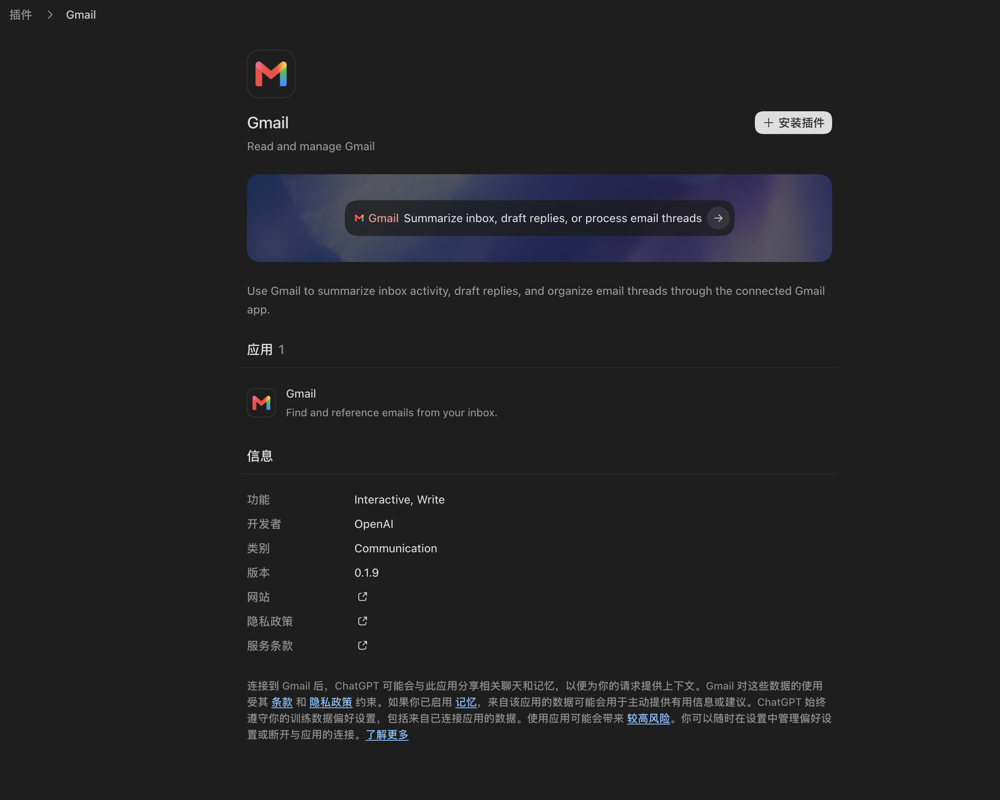

# 插件中心插件详情页 P0 参考复刻计划

日期：2026-08-26  
模式：$plan direct（经独立 Critic 审查后修订；本轮只更新计划与参考资产，不修改业务源码）  
目标：在现有插件中心中补齐“点击插件卡片进入详情页”的真实数据、页面导航、安装状态与外链闭环，按附图和参考项目的核心导航/展示模式完成 P0 复刻；不把参考项目的分享、连接、Hook、定时任务和设置能力误纳入本轮。

## 1. 结论先行

推荐新增一个“按插件读取”的详情接口，而不是在打开插件列表时批量读取所有插件详情。

最终链路：

Renderer 插件卡片
→ App 内部 pluginCenter surface 切到 detail(pluginRef, returnTo)
→ Preload 固定白名单 API
→ Main PluginCenterService 按插件读取、裁剪和缓存
→ provider fork 调用现有 plugin/read
→ Codex app server

这样能满足以下目标：

- 点击插件卡片主体进入详情页，卡片上的安装、启停、卸载动作仍各自独立，不误触导航。
- 详情页使用真实的长描述、开发者、能力、版本、官网、隐私政策、服务条款、默认提示词、截图及插件内应用/技能/MCP 信息。
- 只对当前选中的插件调用 plugin/read，避免现有 includePluginDetails=true 对整个目录产生 N 次读取。
- 安装与状态变更继续复用现有 mutation 流程，不创建第二套安装逻辑。
- 严禁修改 codex/codex-rs/app-server；协议能力已存在，只扩展 provider、main、preload、shared 和 renderer。

### 1.1 复刻边界

本计划中的“参考复刻”专指以下 P0 核心模式：

- 列表卡片主体打开独立详情，卡片内安装/管理动作不误触导航。
- 进入详情时保存浏览 tab、分类、搜索词和滚动位置；返回后恢复原浏览上下文。
- 详情具有 loading、error、missing、ready 四类主状态，并按需读取选中插件。
- 页面复刻附图中的图标/标题/动作、默认提示词主视觉、长描述、包含项、信息和法律说明结构。
- 默认提示词会在插件已安装且启用后创建新对话并预填插件 mention 与提示词，不自动发送。

以下属于对当前架构的合理适配，不宣称与参考项目完全相同：

- 参考项目路由携带 pluginId、remotePluginId、source；本项目的 plugin/read 协议以 marketplacePath/remoteMarketplaceName + pluginName 定位，因此 Renderer 只携带安全的 pluginId + marketplaceId，Main 再解析成 provider locator。
- 参考项目的详情页拥有分享、Try in Chat、打开插件、应用连接、设置、Hook 审核、定时任务等完整动作矩阵；本轮只保留现有安装、启停、卸载和默认提示词入口。
- 参考项目使用自己的主视觉背景与 ChatGPT 法律说明；本项目改用插件截图/品牌色/主题渐变和 dasCowork 的事实性中性文案。
- 详情头部“安装插件”在本轮保持安装后原地更新状态，不自动跳转对话；默认提示词入口才执行“确保安装/启用 → 新对话预填”的流程。

## 2. 参考附图

原始附图尺寸为 2460 × 1970。计划评审与实施以此图为视觉基准。

参考图已固化为 `.omx/plans/assets/plugin-center-reference/06-plugin-detail.png`；实施和评审只使用该仓库内资产，不再依赖系统临时目录。

### 2.1 附图中的稳定视觉结构

1. 顶部是“插件 > Gmail”面包屑，没有浏览页的搜索框和管理/添加工具栏。
2. 主内容继续使用居中窄栏，与当前插件中心 max-w-3xl 的内容宽度一致。
3. 首屏信息区为 60px 左右的插件图标、名称、短描述；右侧是主要安装按钮。
4. 默认提示词区域是圆角大卡片：背景图或品牌色渐变，上面悬浮深色提示词按钮，包含插件图标、插件名、提示词和向右箭头。
5. 默认提示词下面展示长描述。
6. “应用 N”按实际数量展示插件包含的应用；每项包含图标、名称和说明。
7. “信息”使用两列定义列表，展示功能、开发者、类别、版本和三个安全外链。
8. 页面底部在插件包含应用时展示数据使用/隐私说明；文案必须适配 dasCowork 的真实能力，不能照抄参考项目对 ChatGPT 记忆、训练偏好等产品能力的声明。
9. 深色背景、弱分隔线、次级文字、圆角和留白复用现有主题 token，不硬编码独立色板。

## 3. 需求摘要

### 3.1 P0 交付范围

- 浏览页所有插件卡片主体可点击或键盘激活，进入对应详情页。
- 详情页具备返回插件浏览页的面包屑；返回时恢复原 tab、分类、搜索词和 ScrollArea 滚动位置，不重新进入默认首页。
- 详情页按需读取单个插件的完整安全展示数据，并有 loading、missing、error、ready 四种主状态；缓存旧数据刷新失败时在 ready 内容上叠加 stale warning，不把 stale-data 误做第五套页面。
- 详情页包含：
  - 插件图标、名称、短描述。
  - 未安装时的“安装插件”按钮。
  - 已安装时的启停/卸载状态动作，复用现有 ItemActions 语义。
  - 默认提示词展示；点击后先确保插件已安装且启用，再切回新对话并预填“插件 mention + 提示词”，不自动发送；安装/启用失败时留在详情页并显示错误。
  - 长描述。
  - 按实际数据条件渲染“应用 / 技能 / MCP 服务器”分组；附图中的 Gmail 场景只出现“应用 1”。
  - 信息区：功能、开发者、类别、版本、网站、隐私政策、服务条款。
  - 插件包含应用时的数据使用说明。
- 外链统一走现有 window.desktopApp.codex.openExternalHttpUrl，不直接 window.open，也不新增 renderer 权限。
- 桌面宽度和 420px 窄窗口均无横向溢出；窄窗口下标题动作区改为纵向或自动换行。
- 不新增 npm 依赖；优先复用现有 shadcn/Radix 封装。

### 3.2 明确不在本轮

- 插件分享、创建/编辑插件、升级插件、远端插件审核。
- 应用 OAuth/连接流程重做；installUrl 只作为真实安全外链展示或现有连接入口。
- 参考项目的分享、Try in Chat、打开插件、应用 OAuth/连接、应用工具、插件设置、Hook 审核、定时任务管理和完整高级动作矩阵。
- 复制参考项目专有背景图、Gmail 商标或其他品牌资产。背景优先使用插件协议返回的 screenshotUrls/screenshots；没有时用 brandColor 与主题色生成渐变。
- 照抄参考项目关于 ChatGPT Memory、模型训练偏好或 OpenAI Help Center 的法律文案。
- 修改 Codex app server 源码。

## 4. 当前仓库事实与缺口

### 4.1 当前导航与页面

- AppSurface 目前只有 conversation 和 pluginCenter，插件中心状态仅包含 page/tab/category：desktop-app/src/renderer/src/App.tsx:281-288。
- 插件入口直接设置 browse/plugins，PluginCenterPage 的 surface 由 App 持有：desktop-app/src/renderer/src/App.tsx:800-816。
- PluginCenterPage 当前只有 browse/manage 两种 page，surface 没有 pluginId：desktop-app/src/renderer/src/components/plugin-center/PluginCenterPage.tsx:72-89。
- 插件中心已经有内部 navigate helper 和分类面包屑，详情页应沿用同一状态切换方式，不引入 React Router：desktop-app/src/renderer/src/components/plugin-center/PluginCenterPage.tsx:744-780。
- 当前浏览页内容容器为 max-w-3xl，正好匹配附图的居中窄栏：desktop-app/src/renderer/src/components/plugin-center/PluginCenterPage.tsx:847-895。
- 搜索词目前是 PluginCenterPage 内部 useState，不属于 surface；如果只让 returnTo 保存 tab/category，就无法履行“恢复搜索上下文”的验收：desktop-app/src/renderer/src/components/plugin-center/PluginCenterPage.tsx:594-599,887-894。
- 参考项目在打开详情前保存 browseScrollTop、searchQuery、selectedHostId 和当前目录 tab，再执行详情导航：reference-projects/codex-electron-26.818.21641-beautified/webview/assets/plugins-page-CzyEBf5y.js:10861-10884。

### 4.2 当前卡片与交互缺口

- PluginCardGrid 负责两列布局，PluginCard 目前是不可点击 article，只有安装或 ItemActions 可交互：desktop-app/src/renderer/src/components/plugin-center/PluginCenterPage.tsx:1554-1661。
- 卡片视觉密度已有专门测试，实施详情导航时不能通过整卡嵌套 button 破坏 HTML 语义或现有安装按钮：desktop-app/src/renderer/src/components/plugin-center/PluginCenterPage.test.tsx:381-411。
- 推荐结构是 shadcn Card 作为视觉容器，卡片主体使用独立 button，右侧安装/更多动作作为同级交互区；两个交互区不能嵌套。

### 4.3 当前共享数据不足

- PluginCenterPlugin 目前只包含短描述、图标、分类、标签、安装状态、versionLabel、author 和计数：desktop-app/src/shared/pluginCenterApi.ts:112-143。
- PluginCenterService 当前 normalizePlugins 只投影 displayName、shortDescription、category、version 和计数，没有长描述、开发者、能力、法律链接、默认提示词、品牌色或截图：desktop-app/src/main/pluginCenter/PluginCenterService.ts:974-1044。
- includePluginDetails=true 已能批量补充所有插件的 counts，但 getSnapshot 会为整个目录读取详情；该模式适合管理汇总，不适合卡片点击后的单插件详情：desktop-app/src/main/pluginCenter/PluginCenterService.ts:158-199。

### 4.4 现有协议已经提供所需字段

- PluginInterface 已提供 longDescription、developerName、capabilities、websiteUrl、privacyPolicyUrl、termsOfServiceUrl、defaultPrompt、brandColor、screenshots 和 screenshotUrls：desktop-app/vendors/ai-sdk-provider-codex-asp/src/protocol/app-server-protocol/v2/PluginInterface.ts:6-43。
- PluginDetail 已提供 description、skills、apps、mcpServers 等详情：desktop-app/vendors/ai-sdk-provider-codex-asp/src/protocol/app-server-protocol/v2/PluginDetail.ts:4-12。
- AppSummary 提供应用 id、name、description、installUrl 和 category：desktop-app/vendors/ai-sdk-provider-codex-asp/src/protocol/app-server-protocol/v2/AppSummary.ts:5-8。
- provider 当前只有 readPluginDetailsForManagement，会先 plugin/list 再批量 plugin/read；内部已实现本地市场路径和远端市场名两种参数定位：desktop-app/vendors/ai-sdk-provider-codex-asp/src/context-catalog-client.ts:273-283,800-847。
- Main 已有 findPluginLocator，可按 id + marketplaceId 从 catalog 解析 pluginName 与本地/远端市场 locator，并用于安装：desktop-app/src/main/pluginCenter/PluginCenterService.ts:604-620,914-938。
- 因此最短实现是复用 Main 的 catalog 定位逻辑，并给 provider 增加“接收精确 locator、只发一次 plugin/read”的 readPluginDetailForManagement；不要让 provider 再做一次 plugin/list，也不要修改 app-server 或在 Renderer 拼详情。

### 4.5 现有安全能力可直接复用

- Renderer 已有 app:/blob:/data:/https: 图片源检查和加载失败 fallback：desktop-app/src/renderer/src/components/plugin-center/PluginCenterPage.tsx:1133-1221。
- Renderer CSP 已允许 self、app、blob、data 和 https 图片：desktop-app/src/renderer/index.html:6-10。
- 外链已经通过 preload 的 openExternalHttpUrl 进入 main，main 再校验为 HTTP(S) 并调用 shell.openExternal：desktop-app/src/preload/index.ts:135-136，desktop-app/src/main/index.ts:313-315,634-637，desktop-app/src/shared/codexIpcApi.ts:677-686。

### 4.6 参考项目证据

- 参考项目详情页在 loading/error/missing/ready 间切换，并使用独立滚动容器：reference-projects/codex-electron-26.818.21641-beautified/webview/assets/plugin-detail-page-D-RIq6rf.js:4126-4180。
- 参考页从 defaultPrompt 生成主视觉提示词卡，并使用插件 logo/短描述：同文件:4226-4335。
- 参考页激活提示词时会先处理安装/启用，再创建带插件 mention 和 defaultPrompt 的新任务：同文件:9061-9120,9425-9427。
- 参考页信息区按条件展示能力、开发者、类别、版本和三类外链：同文件:4777-4938。
- 参考页长描述优先级为 longDescription → detail.description → shortDescription：同文件:6141-6155。
- 参考页在含应用时显示法律说明：同文件:4633-4714。
- 参考插件列表会把 onOpenPluginDetails 传给卡片，卡片动作与详情导航分开：reference-projects/codex-electron-26.818.21641-beautified/webview/assets/plugins-page-CzyEBf5y.js:2148-2356。
- 参考项目的路由身份包含 pluginId、remotePluginId 和 source，但最终 plugin/read 仍需要解析 marketplacePath/remoteMarketplaceName + pluginName：同列表文件:3439-3450；详情文件:7929-7970。

### 4.7 当前默认提示词接线能力

- Composer 已提供 serializeComposerContextReference，可安全生成 `:plugin[...]` mention directive：desktop-app/src/renderer/src/composer/composerContextDirectiveFormatter.ts:82-88。
- plugin mention 的稳定身份规则已存在于 provider：id 已含 `@` 时直接使用，否则使用 `${plugin.name}@${marketplace.name}`，最后形成 `plugin://...`：desktop-app/vendors/ai-sdk-provider-codex-asp/src/context-catalog-client.ts:228-258。
- App 已能切回 conversation 并启动新会话；runtime 也暴露 startNewConversation 与 setActiveDraft：desktop-app/src/renderer/src/App.tsx:717-721；desktop-app/src/renderer/src/hooks/useCodexIpcAssistantRuntime.ts:188-196,228-235。
- setActiveDraft 闭包绑定当前 activeEntry，不能在 startNewConversation 后立即调用它来假设已指向新 entry；应在 runtime hook 内新增原子 helper，使用 startNewConversation 返回的 entry 写入草稿：desktop-app/src/renderer/src/runtime/ConversationChatRegistry.ts:137-153,350-366。

## 5. 推荐数据与接口设计

### 5.1 新增单插件详情 IPC

在 desktop-app/src/shared/pluginCenterApi.ts 增加：

- pluginCenterGetPluginDetailRequestSchema
  - version
  - cwd 可选
  - threadId 可选
  - plugin: { id, marketplaceId 可选 }；从当前卡片进入时 marketplaceId 必填，仅允许旧状态恢复时缺省。
  - forceRefresh 可选
- pluginCenterPluginDetailSchema
  - plugin：沿用 PluginCenterPlugin 的安装/权限状态。
  - mention：`{ path, name }`；path 必须是 Main 按现有规则生成的 `plugin://...`，name 为 canonical plugin name，Renderer 不自行拼接身份。
  - longDescription 可选。
  - capabilities：去空、去重后的字符串数组。
  - defaultPrompts：最多 3 条，每条最大 128 字符。
  - brandColor 可选，只允许合法 CSS hex/rgb 数据，不接受任意 style 文本。
  - screenshots：只保留 app:/https: 或经本地媒体协议转换后的 URL。
  - websiteUrl/privacyPolicyUrl/termsOfServiceUrl：只允许绝对 HTTP(S)。
  - apps：id/name/description/category/installUrl/icon。
  - skills：id/name/displayName/description/enabled。
  - mcpServers：名称数组。
- pluginCenterGetPluginDetailResultSchema
  - version
  - status: ready 或 missing
  - missingReason：missing 时为 not_found 或 ambiguous。
  - detail：ready 时必填。

不要把原始 PluginDetail、绝对本地路径、插件配置、secret、hook 脚本或任意 app-server payload 直接透传给 Renderer。

### 5.2 provider 单插件读取

在 desktop-app/vendors/ai-sdk-provider-codex-asp/src/context-catalog-client.ts 增加 readPluginDetailForManagement：

1. 方法接收精确 locator：`{ marketplacePath?; remoteMarketplaceName?; pluginName }`，不在 provider 内再次 plugin/list。
2. 本地市场传 marketplacePath + pluginName；远端市场传 remoteMarketplaceName + pluginName。
3. 只发一次 plugin/read，并直接复用 readPluginDetailWithClient 的参数构造。
4. marketplacePath 与 remoteMarketplaceName 必须恰有一个；由 provider 输入校验/类型约束阻止含糊请求。
5. plugin/read 的 missing/协议错误保留可区分结果，让 Main 映射成 missing 或 error，不返回任意同名插件。

对应 provider 测试放在 desktop-app/vendors/ai-sdk-provider-codex-asp/tests/context-catalog-client.test.ts。

### 5.3 Main 安全投影与缓存

在 desktop-app/src/main/pluginCenter/PluginCenterService.ts 增加 getPluginDetail：

- 以 cwd + pluginId + marketplaceId 作为详情缓存 key。
- 缓存 plugin/list 的定位结果与单插件 detail，详情 TTL 与目录缓存保持同级或更短。
- 扩展现有 findPluginLocator，使其同时服务安装和详情读取，并返回选中的 PluginSummary/marketplace 信息：
  - 有 marketplaceId 时必须同时精确匹配 id + marketplace.name。
  - marketplaceId 缺失时先收集所有 id 匹配项；恰好一个才继续，零个返回 not_found，多个返回 ambiguous，禁止“取第一个”。
  - 当前 shared 中的 marketplaceId 实际存放 marketplace.name；本轮保持字段兼容，不顺带做全局重命名。
  - remotePluginId/source 只用于参考项目路由、分享和分析，不参与当前 app-server plugin/read 参数，因此不透传给 Renderer；未来实现分享/分析时另行扩展。
- 将 locator 传给 provider 的 readPluginDetailForManagement，Main 不自行发送或复制 JSON-RPC。
- 使用 PluginInterface 的真实字段构建安全 DTO：
  - 标题：displayName → name。
  - 短描述：shortDescription → detail.description → longDescription。
  - 长描述：longDescription → detail.description → shortDescription。
  - 开发者写入现有 author 字段。
  - 版本：localVersion → version。
  - 类别：interface.category。
  - 应用/技能/MCP：来自 PluginDetail。
- mention 使用现有 provider 规则生成：id 已包含 `@` 时使用 id，否则使用 `${pluginName}@${marketplaceName}`，再加 `plugin://`；只输出 path/name，不输出 sourcePath。
- PluginDetail 的 AppSummary 没有图标；应用行图标按 app id 与缓存的 app/list 安全投影合并，匹配不到时使用插件 icon 或 AppWindowIcon，不为图标触发额外 plugin/read。
- 安装、卸载、启停和强制刷新成功后，失效该插件详情及已安装列表缓存，避免详情页状态滞后。
- URL、文本长度、数组数量和重复项继续由 Zod/normalizer 限制。

### 5.4 Preload 与 Main 注册

在以下位置补一个固定 channel，不开放任意 method：

- desktop-app/src/shared/pluginCenterApi.ts
- desktop-app/src/main/pluginCenter/registerPluginCenterIpc.ts
- desktop-app/src/preload/pluginCenterBridge.ts
- desktop-app/src/preload/index.d.ts

沿用现有 plugin center API version，不另建第二个全局对象。

### 5.5 Renderer 详情资源

在 desktop-app/src/renderer/src/components/plugin-center/pluginCenterDataResource.ts 增加按 cwd/pluginId/marketplaceId 键控的 detail resource：

- 首次进入显示详情 skeleton。
- 返回浏览页再进入同一插件时复用 ready 数据。
- force refresh 或 mutation 成功后重新验证。
- 缓存中有旧详情而后台刷新失败时保留旧内容，并在页面顶部显示可重试 warning。
- 详情资源不得并入目录预热，避免应用启动时读取所有 plugin/read。

## 6. 页面与组件设计

### 6.1 Surface 类型

将 PluginCenterSurface 改为可辨识联合类型：

- 先定义 PluginCenterBrowseContext：`{ tab: plugins/skills; category?; search: string; scrollTop: number }`。
- browse：`{ page: browse } & PluginCenterBrowseContext`；搜索框改为受 surface 控制，不再使用无法恢复的独立 useState。
- manage：page=manage，tab=plugins/apps/mcp/skills。
- detail：page=detail，pluginRef=`{ id; marketplaceId? }`，returnTo 保存完整 PluginCenterBrowseContext。

AppSurface 可改为 conversation | ({ kind: pluginCenter } & PluginCenterSurface)，避免 App 再手工复制 page/tab/category 字段。

打开详情前从 ScrollArea viewport 读取 scrollTop，并与 tab/category/search 一起写入 returnTo。返回时先恢复 browse surface，再在 viewport 挂载后恢复一次 scrollTop；恢复完成后清除 pending restore，避免每次渲染反复跳动。

现有 shadcn ScrollArea wrapper 只转发 Root props，没有暴露 Viewport ref：desktop-app/src/renderer/src/components/ui/scroll-area.tsx:6-25。为它增加可选 `viewportRef` 并挂到 ScrollAreaPrimitive.Viewport；保持其余调用方 API 不变。搜索词变化时把待恢复 scrollTop 设为 0，实际滚动期间只更新局部 ref，打开详情时再捕获，避免每个 scroll 事件都触发 App 级重渲染。

从详情返回时使用 returnTo；如果详情是从外部恢复或 returnTo 缺失，则回退到 `{ page: browse, tab: plugins, search: '', scrollTop: 0 }`。从插件中心切到 conversation 时保留最后 browse surface，重新打开插件中心沿用现有产品语义，不在本轮新增 URL Router。

### 6.2 卡片点击

修改 PluginCard 与 PluginCardGrid：

- 增加 onOpenDetails(plugin)。
- shadcn Card 作为视觉容器，添加 data-slot=plugin-card。
- 图标/标题/描述区域使用独立 button，aria-label 为“查看 {插件名} 详情”。
- 安装按钮、Switch/DropdownMenu 与主体 button 同级；安装按钮点击不触发详情导航。
- onOpenDetails 同时携带 `{ id, marketplaceId }` 并捕获当前 tab/category/search/scrollTop；正常目录卡片必须提供 marketplaceId。
- Enter/Space 可打开详情；hover 和 focus-visible 与现有 hover:bg-foreground/5 保持一致。
- 单元测试不再依赖裸 article 选择器，改用稳定 data-slot 和角色查询。

### 6.3 详情页骨架

建议新建 desktop-app/src/renderer/src/components/plugin-center/PluginDetailPage.tsx，让 PluginCenterPage 继续负责资源、mutation 和 surface 分发，详情布局不继续膨胀现有 2500 行文件。

优先复用的 shadcn 组件：

| 页面区域 | 组件 |
| --- | --- |
| 安装、返回、默认提示词动作、外链图标 | Button |
| 默认提示词主视觉、应用/技能/MCP 行 | Card / CardContent |
| 区块分隔 | Separator |
| 整页滚动 | ScrollArea |
| loading | Skeleton |
| 启停与卸载 | 现有 Switch、DropdownMenu、Dialog、ItemActions 语义 |
| 成功/错误反馈 | Sonner |

当前没有 Breadcrumb/AspectRatio 组件文件，也没有必要新增依赖：

- 面包屑沿用现有 nav + button + ChevronRightIcon。
- 主视觉比例用普通 div、aspect-ratio Tailwind class 和 object-cover 实现。

### 6.4 详情页具体布局

1. 顶部 56px 导航：
   - “插件”按钮。
   - ChevronRightIcon。
   - 当前插件名。
2. ScrollArea 内 max-w-3xl px-6 pb-8。
3. HeroHeader：
   - 60px 图标。
   - 标题 text-xl/font-medium。
   - 短描述 text-muted-foreground。
   - 右侧主要动作；窄屏下落到下一行。
4. PromptHero：
   - 仅 defaultPrompts 非空时显示。
   - 背景优先 screenshots[0]，其次 brandColor 渐变，再次主题默认渐变。
   - 提示词按钮展示插件 icon、名称、文本、ArrowRightIcon。
   - 点击执行 ensurePluginReady：未安装先调用现有 installPlugin，已安装但禁用则调用现有 setPluginEnabled；任一步失败都留在详情页并保留错误。
   - ready 后调用 App 的 onActivatePluginPrompt，由 runtime 原子创建新对话并预填，不自动发送。
   - 详情头部“安装插件”只执行安装并原地刷新，不隐式触发提示词或跳转对话；这是本轮相对参考项目的明确裁剪。
5. LongDescription：
   - 保留换行，禁止渲染未净化 HTML。
6. Includes：
   - apps/skills/mcpServers 非空才渲染。
   - 标题显示数量。
   - 应用行使用匹配的 app/list 图标；没有图标时回退插件 icon 或 AppWindowIcon。
7. Information：
   - dl 两列，标签固定宽度。
   - 空的开发者/类别/版本不展示。
   - 网站无 URL 时显示“不可用”；隐私政策和服务条款无 URL 时隐藏。
   - 外链按钮使用 ExternalLinkIcon，并走受控 bridge。
8. LegalNotice：
   - 仅 apps.length > 0 时出现。
   - 单应用时可引用该插件自己的 terms/privacy URL。
   - 文案只描述“插件或应用可能获得完成请求所需的上下文，数据使用受开发者条款约束”，不声明本项目不存在的记忆、训练或设置能力。

## 7. 实施步骤

### 步骤 1：固定视觉基准与回归边界

- 使用已固化的 .omx/plans/assets/plugin-center-reference/06-plugin-detail.png；测试/评审不得再引用系统临时路径。
- 在现有 PluginCenterPage 测试中补卡片主体/安装动作分离的回归测试，再改实现。
- 记录桌面与 420px 窄窗口的目标截图和关键尺寸，并校验参考资产可从计划链接加载。

涉及文件：

- .omx/plans/plugin-center-plugin-detail-page-parity-plan.md
- .omx/plans/assets/plugin-center-reference/06-plugin-detail.png
- desktop-app/src/renderer/src/components/plugin-center/PluginCenterPage.test.tsx
- desktop-app/tests/e2e/plugin-center.e2e.ts

### 步骤 2：定义安全详情 DTO

- 在 shared schema 增加单插件详情 request/result。
- 为 URL、颜色、默认提示词、截图、应用/技能/MCP 摘要写拒绝测试。
- 确保 secret、file://、javascript:、超长文本和未知字段被拒绝。

涉及文件：

- desktop-app/src/shared/pluginCenterApi.ts
- desktop-app/src/shared/pluginCenterApi.test.ts

### 步骤 3：实现 provider 单插件读取

- 增加接收精确 locator 的单次 plugin/read 方法，不在 provider 内重复 plugin/list。
- 覆盖远端市场、本地市场、互斥 locator 校验、missing 和单次 RPC 断言。
- 不修改生成协议类型与 app-server。

涉及文件：

- desktop-app/vendors/ai-sdk-provider-codex-asp/src/context-catalog-client.ts
- desktop-app/vendors/ai-sdk-provider-codex-asp/tests/context-catalog-client.test.ts

### 步骤 4：实现 Main 投影、缓存与 IPC

- PluginCenterService 扩展现有 findPluginLocator，按 id + marketplaceId 精确定位；省略 marketplaceId 时只接受唯一匹配，并分别返回 not_found/ambiguous。
- 读取单个详情并安全归一化，生成 mention path/name，并按 app id 合并已有 app/list 图标。
- mutation/refresh 后失效详情缓存。
- 注册 getPluginDetail channel，补 handler 和错误归一化测试。
- preload 暴露固定方法并更新声明。

涉及文件：

- desktop-app/src/main/pluginCenter/PluginCenterService.ts
- desktop-app/src/main/pluginCenter/PluginCenterService.test.ts
- desktop-app/src/main/pluginCenter/registerPluginCenterIpc.ts
- desktop-app/src/main/pluginCenter/registerPluginCenterIpc.test.ts
- desktop-app/src/preload/pluginCenterBridge.ts
- desktop-app/src/preload/pluginCenterBridge.test.ts
- desktop-app/src/preload/index.d.ts

### 步骤 5：实现 surface 与卡片导航

- 把 surface 改为 detail 可辨识联合。
- 将 browse 的 search/scrollTop 提升为可恢复的 PluginCenterBrowseContext；打开详情前捕获 ScrollArea viewport 位置，返回后恢复一次。
- 卡片主体可访问地触发 onOpenDetails。
- 安装/启停/卸载动作不导航。
- returnTo 保存并恢复 tab/category/search/scrollTop；缺失 returnTo 时使用明确默认值。

涉及文件：

- desktop-app/src/renderer/src/App.tsx
- desktop-app/src/renderer/src/App.test.tsx
- desktop-app/src/renderer/src/components/ui/scroll-area.tsx
- desktop-app/src/renderer/src/components/plugin-center/PluginCenterPage.tsx
- desktop-app/src/renderer/src/components/plugin-center/PluginCenterPage.test.tsx
- desktop-app/src/renderer/src/components/plugin-center/index.ts

### 步骤 6：实现详情资源与 UI

- 新增 detail resource。
- 新建 PluginDetailPage 并按第 6 节拆分 HeroHeader、PromptHero、Includes、Information、LegalNotice。
- 复用 Button/Card/Separator/ScrollArea/Skeleton/Switch/DropdownMenu/Dialog/Sonner。
- 抽取通用安全图片组件或复用 ItemIcon，避免复制 URL 白名单。
- 安装/状态 mutation 成功后更新详情和浏览缓存。

涉及文件：

- desktop-app/src/renderer/src/components/plugin-center/pluginCenterDataResource.ts
- desktop-app/src/renderer/src/components/plugin-center/pluginCenterDataResource.test.ts
- desktop-app/src/renderer/src/components/plugin-center/PluginDetailPage.tsx
- desktop-app/src/renderer/src/components/plugin-center/PluginDetailPage.test.tsx
- desktop-app/src/renderer/src/components/plugin-center/PluginCenterPage.tsx
- desktop-app/src/renderer/src/components/plugin-center/index.ts

### 步骤 7：接入默认提示词

- PluginDetailPage 将选中的 defaultPrompt 交给 PluginCenterPage；PluginCenterPage 先复用现有 mutation 顺序执行 ensurePluginReady：未安装 → install，禁用 → enable，最后重新读取状态。
- Main detail DTO 提供经过校验的 mention.path 与 mention.name。App 使用 `serializeComposerContextReference({ type: 'plugin', path, label, mentionName })` 生成 directive，再与提示词以一个空格拼接。
- 在 useCodexIpcAssistantRuntime 增加 `startNewConversationWithDraft(draft)`：使用 `const entry = registry.startNewConversation()` 返回值，再调用 `registry.setDraft(entry, draft)` 和 `registry.setDraftAttachments(entry, [])`。不要使用“startNewConversation 后立即 setActiveDraft”，避免 setActiveDraft 仍绑定旧 activeEntry 的竞态。
- App 的 onActivatePluginPrompt 顺序固定为：setSurface(conversation) → clearActiveConversationId() → startNewConversationWithDraft(serializedDraft)。不自动发送，不改模型/审批模式/项目选择。
- 旧会话的草稿和附件保留在旧 entry；新会话按正常默认值启动且附件为空，因此不需要“覆盖现有草稿”确认框。
- 安装或启用失败时不得创建新会话；重复点击期间禁用提示词按钮，避免产生多个新会话。
- 补 runtime hook、App 和 Composer 回归测试，覆盖 mention 序列化、安装/启用顺序、失败不跳转、旧草稿保留、新草稿落到新 entry、附件为空和不自动发送。

主要涉及：

- desktop-app/src/renderer/src/App.tsx
- desktop-app/src/renderer/src/App.test.tsx
- desktop-app/src/renderer/src/hooks/useCodexIpcAssistantRuntime.ts
- desktop-app/src/renderer/src/hooks/useCodexIpcAssistantRuntime.navigation.test.ts
- desktop-app/src/renderer/src/composer/composerContextDirectiveFormatter.ts 及现有测试（只复用既有 serializer，除非测试暴露缺口，否则不改实现）

### 步骤 8：完善 E2E 与视觉证据

- 扩展 plugin-center-app-server fixture 的 PluginInterface 和 PluginDetail。
- 新增“筛选/滚动列表 → 卡片详情 → 安装 → 状态更新 → 返回原分类、搜索词和滚动位置”的真实 Electron E2E。
- 新增“默认提示词 → 必要时安装/启用 → 新对话 mention + prompt 预填”的 Electron E2E；失败路径不得跳转。
- 断言只对选中的插件调用一次 plugin/read。
- 在桌面和 420px 窄窗口保存 screenshot artifact，并检查无横向溢出。

涉及文件：

- desktop-app/tests/e2e/support/plugin-center-app-server.mjs
- desktop-app/tests/e2e/plugin-center.e2e.ts

## 8. 可测试验收标准

### 导航

- 点击任一插件卡片主体后，data-slot=plugin-detail-page 可见，面包屑含“插件”和插件显示名。
- 点击卡片内“安装”只调用 installPlugin，不调用 onOpenDetails。
- 键盘聚焦卡片主体后按 Enter 或 Space 能进入详情。
- 从分类/搜索结果滚动到非零位置后进入插件详情并返回，原 tab、category、search 输入值和 ScrollArea scrollTop 均恢复；scrollTop 允许 ±2px 渲染误差。
- detail surface 缺少 returnTo 时回退到 browse/plugins、空搜索和 scrollTop=0。
- 点击侧栏会话后退出插件详情且聊天 runtime、threadId 和草稿保持现有语义。

### 数据

- 打开一个详情只新增一次对应 plugin/read；2917 插件目录不会产生批量详情读取。
- local marketplace 和 remote marketplace 的 plugin/read 参数都正确。
- 正常卡片以 id + marketplaceId 精确定位；省略 marketplaceId 时恰好一个匹配才成功，零个返回 not_found，多个返回 ambiguous，绝不读取第一个同名插件。
- provider 接收 locator 后不额外调用 plugin/list，且 marketplacePath/remoteMarketplaceName 恰有一个。
- 详情字段优先级符合：标题 displayName→name；长描述 longDescription→detail.description→shortDescription；版本 localVersion→version。
- mention.path 符合 `plugin://<id>` 或 `plugin://<name>@<marketplaceName>` 规则，Renderer 不接收 sourcePath。
- javascript:、file: 和非 HTTP(S) 法律链接不会到达 Renderer。
- 默认提示词最多 3 条且每条不超过 128 字符。
- snapshot 和日志中不出现 secret、token、原始 config 或插件脚本内容。

### UI

- 详情页主内容保持 max-w-3xl，桌面视觉结构与附图一致。
- 60px 插件图标加载失败时展示 fallback，不出现破图。
- defaultPrompts 为空时不显示主视觉卡；有值时显示背景、提示词、插件名和箭头。
- apps/skills/mcpServers 只在非空时显示，标题数量与行数一致。
- 信息区只显示有真实值的普通字段；网站无值显示“不可用”，隐私/条款无值隐藏。
- 420×900 视口下 body.scrollWidth ≤ body.clientWidth + 1。
- 所有按钮有可读 aria-label，焦点样式可见，颜色对比继续使用主题 token。

### 状态与动作

- 未安装插件显示“安装插件”；安装中按钮禁用并显示进度；成功后无需离开详情即可变为已安装状态。
- 安装失败保留详情内容并显示错误，不伪造成功。
- 已安装插件启停/卸载沿用现有 restriction、确认和 toast 语义。
- 详情头部安装只安装并原地更新，不切换会话；提示词点击则在插件已安装且启用后创建一个新会话并预填 `:plugin[...] + 空格 + prompt`。
- 未安装/禁用插件点击提示词时，调用顺序分别为 install → 状态刷新 → enable（如仍需要）→ 新会话；任一 mutation 失败时新会话调用次数为 0。
- 新对话不会自动发送，附件为空，旧会话草稿/附件保持不变；连续快速点击只创建一个新会话。
- 详情刷新失败且有缓存时保留旧详情并显示可重试 warning。
- missing 插件显示“未找到插件”和返回入口，不崩溃。

### 合规

- 业务 diff 不包含 codex/codex-rs/app-server/。
- 不复制 Gmail/OpenAI 品牌图或参考项目专有背景资源。
- LegalNotice 不包含本项目未实现的 ChatGPT Memory、训练偏好或设置声明。
- 计划与视觉测试引用 `.omx/plans/assets/plugin-center-reference/06-plugin-detail.png`，不引用系统临时目录中的原始剪贴板文件。
- 验收只覆盖第 1.1 节定义的 P0 核心模式；不把分享、连接、设置、Hook 或定时任务缺失误判为本轮回归。

## 9. 风险与缓解

| 风险 | 影响 | 缓解 |
| --- | --- | --- |
| 复用 includePluginDetails=true 导致大目录 N 次 plugin/read | 打开详情变慢、破坏现有 2917 插件性能目标 | 新增按插件 API；E2E 断言只读选中插件一次 |
| 整个卡片包 button，内部又有安装 button | 非法嵌套、键盘和点击冲突 | Card 容器内使用主体 button 与动作区同级 |
| returnTo 只保存 tab/category | 返回后搜索和滚动位置丢失，违背参考导航行为 | 使用 PluginCenterBrowseContext 保存 tab/category/search/scrollTop；E2E 验证 ±2px |
| 只按 pluginId 读取 | 同 id 的不同 marketplace 可能读错插件 | 正常卡片必须传 marketplaceId；缺省时只接受唯一匹配，ambiguous 不读取 |
| 详情缓存未随安装/卸载失效 | 页面展示旧状态 | mutation 成功后同时失效 detail、installed、catalog 合并缓存 |
| 直接透传 PluginDetail | 暴露路径、未知字段或未来协议数据 | Main 建立显式安全 DTO，shared 使用 strict Zod |
| 远程截图或链接协议不安全 | XSS、任意协议打开 | 图片复用现有 allowlist；外链只接受 HTTP(S) 且走 main 校验 |
| 附图法律文案与 dasCowork 能力不一致 | 产品和合规误导 | 只复刻排版，使用本项目事实性中性文案 |
| startNewConversation 后直接 setActiveDraft | React 闭包仍指向旧 activeEntry，提示词写进旧会话 | runtime 提供 startNewConversationWithDraft，并对返回 entry 原子写草稿/空附件 |
| 把“参考复刻”理解为完整功能 parity | 执行范围膨胀到分享、连接、Hook、定时任务 | 第 1.1 节固定 P0 对齐矩阵和明确裁剪，验收只覆盖本轮范围 |
| 当前插件中心文件仍在工作树中 | 执行时误覆盖用户已有改动 | 在当前工作树上增量修改，禁止 reset/checkout，实施前重读最新 diff |
| PluginCenterPage 已超过 2500 行 | 详情继续堆叠后难维护 | 新建 PluginDetailPage 与独立测试，Page 只保留编排 |
| 参考资产再次被改回临时路径 | 计划失去稳定视觉基准 | 资产已固化到 .omx/plans/assets；合规检查只接受仓库内图片链接 |

## 10. 验证步骤

按改动层级从小到大运行：

1. Provider：
   - npm --prefix desktop-app/vendors/ai-sdk-provider-codex-asp run lint
   - npm --prefix desktop-app/vendors/ai-sdk-provider-codex-asp run typecheck
   - 运行 context-catalog-client 相关测试
2. Desktop 定向测试：
   - pluginCenterApi.test.ts
   - PluginCenterService.test.ts
   - registerPluginCenterIpc.test.ts
   - pluginCenterBridge.test.ts
   - pluginCenterDataResource.test.ts
   - PluginCenterPage.test.tsx
   - PluginDetailPage.test.tsx
   - App.test.tsx 中插件 surface 相关用例
   - useCodexIpcAssistantRuntime.navigation.test.ts 中原子新会话草稿用例
   - composerContextDirectiveFormatter.test.ts 中 plugin mention 用例
3. Desktop 全量：
   - npm --prefix desktop-app run lint
   - npm --prefix desktop-app test
4. Electron E2E：
   - npm --prefix desktop-app run test:e2e -- tests/e2e/plugin-center.e2e.ts --reporter=line
5. 视觉检查：
   - `test -f .omx/plans/assets/plugin-center-reference/06-plugin-detail.png` 成功，且文件识别为 2460×1970 PNG。
   - 本计划的 Markdown 图片链接以 `assets/plugin-center-reference/06-plugin-detail.png` 开头。
   - 桌面视口截图与本计划附图并排检查。
   - 420×900 截图检查标题动作折行、定义列表、法律文案和横向溢出。
6. Diff 边界：
   - git diff --name-only 中不得出现 codex/codex-rs/app-server/。

## 11. 完成条件

只有在以下条件同时满足时才可声明完成：

- 卡片主体、安装动作和键盘导航均有自动化测试。
- 返回详情前的 tab/category/search/scrollTop 能完整恢复，并有 Electron E2E 证据。
- 单插件详情真实来自 plugin/read，且大目录不会批量读取详情。
- id/marketplaceId 定位、唯一回退和 ambiguous 拒绝均有 provider/Main 测试。
- 默认提示词只在插件安装且启用后原子创建带 mention 草稿的新会话；旧会话草稿/附件不丢失且不会自动发送。
- 详情页 desktop/narrow 两种布局均有截图证据且无溢出。
- 安装、错误、missing、缓存刷新和返回上下文均已验证。
- shared/provider/main/preload/renderer/e2e 的目标测试全部通过，或明确记录无法运行的外部原因。
- 没有修改 Codex app server，没有复制参考项目品牌资产，没有加入不准确的法律声明；计划参考图使用仓库内稳定资产。

## 12. 执行建议

该计划适合单一 executor 按 shared → provider → main/preload → renderer → e2e 的顺序完成；文件之间依赖较强，并行拆分收益有限。若确需并行，可只把“DTO/provider/main”与“详情 UI 骨架/单测”拆为两个不改同一文件的独立 lane，最终由主执行者统一集成和验证。

## 13. 本次修订记录

- 将目标从含糊的“完整参考复刻”收窄为“附图与参考项目核心导航/展示模式的 P0 复刻”，明确列出未复刻动作矩阵。
- 将参考截图复制到仓库内 assets，并把 Markdown 改为稳定相对链接。
- 将 returnTo 扩展为 tab/category/search/scrollTop，补 ScrollArea viewport ref 与恢复验收。
- 明确 id + marketplaceId 的唯一定位规则、缺省时的 not_found/ambiguous 处理，以及不透传 remotePluginId/source 的理由。
- 将默认提示词流程改为 ensurePluginReady → 安全 mention 序列化 → runtime 原子创建带草稿的新会话，消除 setActiveDraft 指向旧 entry 的竞态。
- 同步更新实施步骤、验收标准、风险、验证命令和完成条件。
