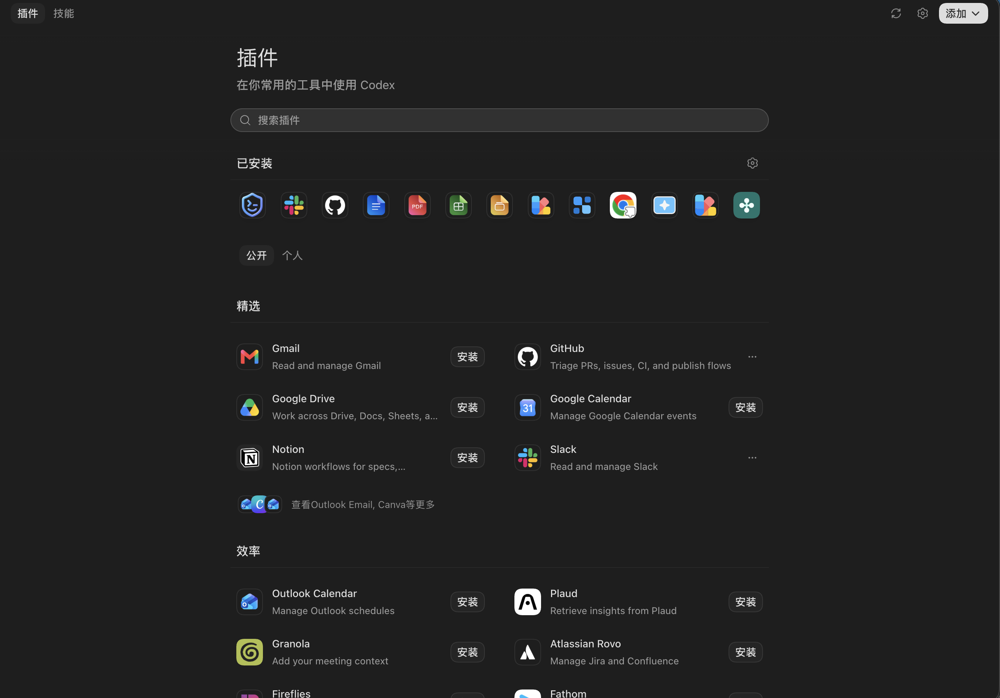
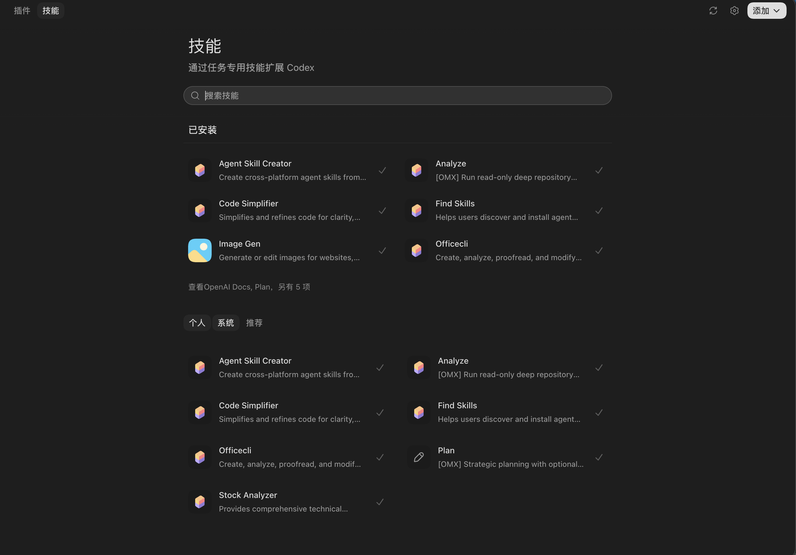
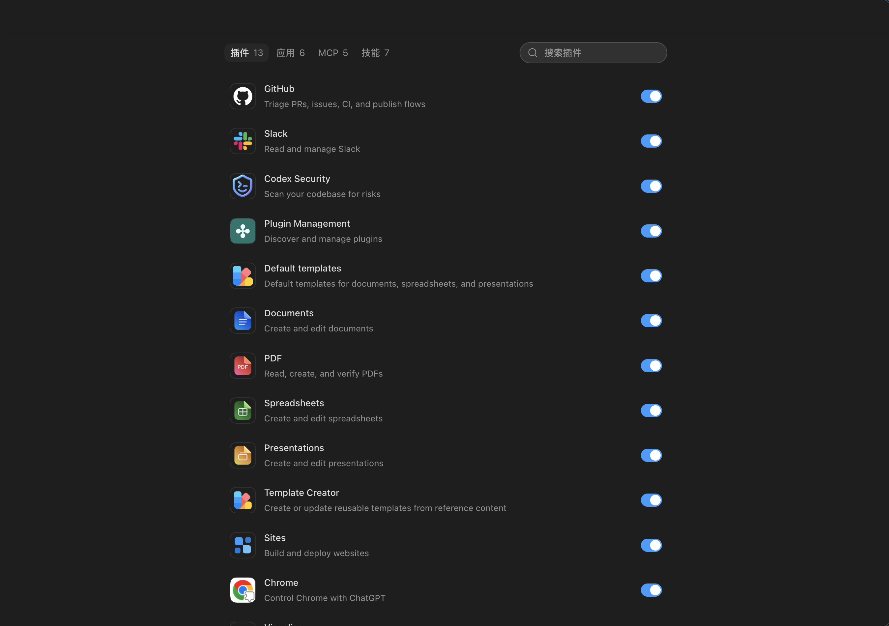
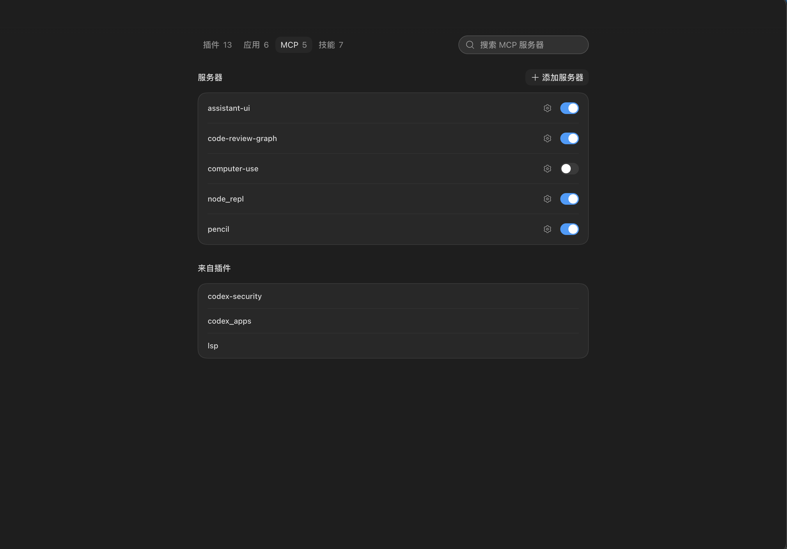
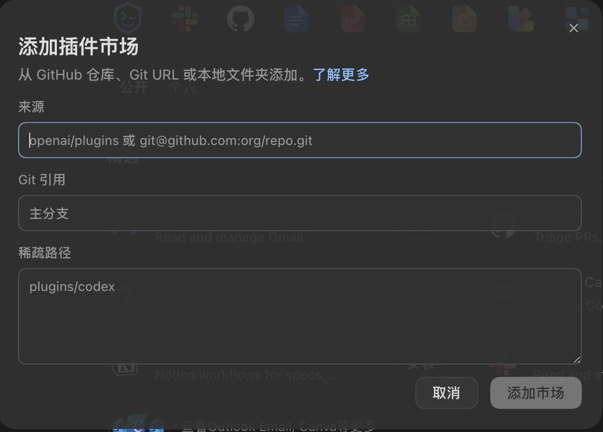

# 插件中心参考项目复刻实施计划

日期：2026-08-24  
模式：`$plan` direct（本轮只输出实施计划，不修改业务源码）  
目标：在不修改 Codex app server 的前提下，为 dasCowork 补齐参考项目的插件中心浏览、技能浏览、统一管理、MCP 管理和“添加插件市场”真实功能闭环，并按 5 张截图还原深色 UI。

## 1. 结论先行

这不是一个只做页面的任务。推荐实现为一条真实的四层链路：

```text
Renderer 插件中心页面
  -> Preload 白名单 API
  -> Main PluginCenterService（校验、权限边界、缓存、错误归一化）
  -> provider fork 的 app-server JSON-RPC 薄封装
  -> 现有 Codex app server RPC
```

本轮按以下边界交付：

- 左侧“新对话”下方增加“插件”入口；插件中心与聊天主界面可来回切换，不新建第二套窗口或 LLM 链路。
- 浏览页包含“插件 / 技能”两个 tab、搜索、刷新、已安装区、真实推荐/分类区、安装与更多操作。
- 管理页包含“插件 / 应用 / MCP / 技能”四个 tab、计数、搜索、真实启停状态；MCP 页区分普通服务器与“来自插件”。
- “添加”下拉菜单至少提供“添加插件市场”和“添加 MCP 服务器”；“添加插件市场”弹窗真实调用 `marketplace/add`，成功后刷新目录。
- 插件安装/卸载/启停、技能启停、应用启停、MCP 启停及普通 MCP 的新增/编辑都要形成真实写入闭环；失败必须回滚 UI 并显示原因，不能假装成功。
- 浏览页只显示 app-server/provider 能提供的真实目录数据。若远程目录功能未启用或没有配置市场，展示明确空态，不复制参考项目专有 `/ps/plugins/*` 请求，也不放静态假卡片。
- 不新增依赖；优先复用现有 shadcn/Radix 封装。当前缺少的 `Tabs`、`Switch`、`Textarea`、`Separator` 以项目现有 `radix-ui` 依赖补成 shadcn 风格薄组件。
- 实施 diff 严禁包含 `codex/codex-rs/app-server/`。

## 2. 需求解释与交付范围

### 2.1 本轮 P0

1. 侧栏入口与页面切换。
2. 插件浏览 tab：真实目录、搜索、刷新、已安装、分类/精选、安装/卸载/启停。
3. 技能浏览 tab：真实已安装技能、作用域、搜索、刷新、启停；推荐区只显示真实可安装来源。
4. 管理页：插件、应用、MCP、技能四个 tab，真实数量与当前状态。
5. MCP：普通服务器列表、插件提供的服务器列表、启停、新增、编辑；插件提供项是只读归属展示，由所属插件控制。
6. 添加插件市场：来源、Git 引用、稀疏路径、校验、提交、成功/重复/失败反馈、提交后刷新。
7. 加载、空、错误、权限限制、正在写入状态；键盘和读屏可用。
8. provider、main、preload、renderer 的分层自动化测试与一条真实 Electron E2E。

### 2.2 明确不在本轮

- 插件详情页、分享插件、创建插件/技能向导、市场移除/升级完整管理页。
- 复制或分发参考项目中的专有品牌资源、打包插件、私有接口或 `/ps/plugins/*` 后端。
- 登录/OAuth 流程重做。应用未连接或不可访问时只展示真实状态和已有安装链接/限制原因。
- 多主机、云端 workspace、远程 host 下拉器。当前实现只管理本桌面 app-server 上下文。
- 任何 Codex app server 源码修改。

这些能力可列为 P1，但不能用无操作按钮或假数据伪装为已完成。

## 3. 参考行为与当前仓库证据

### 3.1 截图与参考项目行为

以下 5 张原始附图已复制到计划资产目录，计划评审与后续实施统一以这些仓库内文件为视觉基准，不再依赖系统临时目录。

#### 图 1：插件浏览页



#### 图 2：技能浏览页



#### 图 3：管理页的插件列表



#### 图 4：管理页的 MCP 列表



#### 图 5：添加插件市场弹窗



- 截图 1/2 的共同框架是顶部工具栏、左侧“插件/技能”tab、右侧刷新/管理/添加、居中内容区、标题/副标题/搜索、已安装区与下方分类列表。插件列表以两列卡片呈现，技能列表以两列紧凑行呈现。
- 截图 3/4 的管理页顶部是带数量的“插件 / 应用 / MCP / 技能”tab 和当前 tab 搜索；普通项目右侧有开关，MCP 页面还包含普通服务器卡片和“来自插件”只读分组。
- 截图 5 的“添加插件市场”是宽 Dialog，包含来源、Git 引用、稀疏路径、取消和禁用态提交按钮；来源必填。
- 参考浏览路由、管理路由与插件详情参数位于 `reference-projects/codex-electron-26.818.21641-beautified/.vite/build/src-PzwkD6WC.js:18654-18808`。
- 参考设置页将插件中心作为统一页面，并支持 `manageOnly`、初始 tab 和 MCP 创建入口：`reference-projects/codex-electron-26.818.21641-beautified/webview/assets/plugins-settings-CD2Okt5X.js:43-81`。
- 参考浏览页的插件/技能 tab、标题、搜索、已安装和分类列表位于 `reference-projects/codex-electron-26.818.21641-beautified/webview/assets/plugins-page-CzyEBf5y.js:1091-1121,10992-11355`。
- 参考管理页的插件/应用/MCP/技能 tab、数量和内容分支位于同一 bundle 的 `:11101-11228,12207-12324`。
- 参考插件安装、启停、卸载菜单位于同一 bundle 的 `:2921-3005,3143-3154`。
- 参考添加市场表单会 trim `source`、保留可选 `refName`、按逗号或换行拆分 `sparsePaths`，成功后强制刷新：同一 bundle `:451-484,487-770,818-841`。
- 参考远端精选目录依赖专有 `/ps/plugins/*` 请求：`reference-projects/codex-electron-26.818.21641-beautified/webview/assets/skills-page-D-y6JxYW.js:2788-2800,4186`。本项目不能照搬该后端。

### 3.2 当前 UI 与导航事实

- 应用当前直接由 `App` 组织主界面，没有现成 React Router 页面层：`desktop-app/src/renderer/src/App.tsx:533-790`。
- 左侧主操作区目前只有“新对话”一个按钮，正好是新增入口位置：`desktop-app/src/renderer/src/sidebar/SidebarPrimaryActions.tsx:17-28`。
- 主内容区当前固定渲染 `ConversationWorkspaceLayout` 与 `ActiveConversationPane`：`desktop-app/src/renderer/src/App.tsx:749-790`。插件中心应作为同一级主界面，不嵌入聊天消息区域。
- shadcn 配置已经存在：`desktop-app/components.json:1-20`；现有组件包括 `button.tsx`、`dialog.tsx`、`dropdown-menu.tsx`、`input.tsx`、`scroll-area.tsx`、`skeleton.tsx`、`sonner.tsx` 和 `tooltip.tsx`。
- 深色主题 token 已集中在 `desktop-app/src/renderer/src/assets/globals.css:16-160`，插件页面必须复用 token，不硬编码一套孤立主题。
- 项目已经依赖 `radix-ui`、`shadcn` 和 `lucide-react`：`desktop-app/package.json:106-112`，无需新增包。

### 3.3 当前真实数据与缺口

- 当前共享 MCP DTO 只有 `name/connected/authStatus/toolCount`，是只读状态：`desktop-app/src/shared/mcpServerStatus.ts:14-42`。
- MCP preload 桥只暴露 `codex:list-mcp-servers`：`desktop-app/src/preload/mcpServerStatusBridge.ts:10-21`；main 服务也只调用 `listMcpServerStatus`：`desktop-app/src/main/mcp/McpServerStatusService.ts:27-43`。
- provider catalog client 已封装 `skills/list`、`plugin/installed`、`app/list`、`mcpServerStatus/list`：`desktop-app/vendors/ai-sdk-provider-codex-asp/src/context-catalog-client.ts:146-242`。
- 现有 `listInstalledPlugins` 会过滤掉未安装、禁用和非本地插件：同文件 `:162-195`；现有 `listApps` 会过滤 `!isEnabled` 或 `!isAccessible` 应用：同文件 `:435-445`。它们适合 composer mention，不适合管理页，不能直接复用同一裁剪 DTO。
- `DesktopCodexApi` 目前没有插件中心管理 API：`desktop-app/src/shared/codexIpcApi.ts:677-695`。
- main 已创建可复用的 catalog client 并注入现有服务：`desktop-app/src/main/index.ts:192-209`。新增 `PluginCenterService` 应复用同一个 app-server 客户端生命周期，而不是启动第二个 app-server。

### 3.4 可直接使用的 app-server RPC（只读协议证据）

以下 RPC 已存在，因此实现只需扩 provider fork，不需要修改 app-server：

- `skills/list`、`marketplace/add/remove/upgrade`、`plugin/list/installed/read/install/uninstall`、`app/list`、`skills/config/write`：`codex/codex-rs/app-server-protocol/src/protocol/common.rs:657-735,784-797`。
- `config/mcpServer/reload`、`config/read`、`config/value/write`、`config/batchWrite`：同文件 `:953,1097-1128`。
- `PluginSummary` 已含来源、installed/enabled、策略、分类、远程/本地图标：`codex/codex-rs/app-server-protocol/src/protocol/v2/plugin.rs:599-620,699-750`。
- `PluginDetail` 已含 skills、apps、app templates 和 `mcp_servers`，可用于构建“来自插件”分组：同文件 `:640-651`。
- `AppInfo` 已含完整展示信息、`isAccessible` 和 `isEnabled`：`codex/codex-rs/app-server-protocol/schema/typescript/v2/AppInfo.ts:8-19`。
- `SkillsConfigWriteParams` 支持按 path 或 name 启停：`codex/codex-rs/app-server-protocol/schema/typescript/v2/SkillsConfigWriteParams.ts:6-14`。
- `MarketplaceAddParams` 正好是 `source/refName/sparsePaths`：`codex/codex-rs/app-server-protocol/schema/typescript/v2/MarketplaceAddParams.ts:5`；响应包含 `marketplaceName/installedRoot/alreadyAdded`：`MarketplaceAddResponse.ts:5-6`。
- 插件安装由 `marketplacePath` 或 `remoteMarketplaceName` 加 `pluginName` 定位：`codex/codex-rs/app-server-protocol/schema/typescript/v2/PluginInstallParams.ts:6`。
- 普通 MCP 状态列表本身没有 enabled/source 字段：`codex/codex-rs/app-server-protocol/src/protocol/v2/mcp.rs:35-78`。管理页必须将 `mcpServerStatus/list`、安全裁剪后的 `config/read` 与已安装插件的 `plugin/read` 结果合并，不能从 connected 猜 enabled。

## 4. 推荐产品行为

### 4.1 页面切换

不为本功能引入路由依赖。给 `App` 增加一个小型、可枚举的主界面状态：

```ts
type AppSurface =
  | { kind: 'conversation' }
  | { kind: 'pluginCenter'; page: 'browse' | 'manage'; tab: 'plugins' | 'skills' | 'apps' | 'mcp' }
```

- 点击侧栏“插件”进入 `{ page: 'browse', tab: 'plugins' }`。
- 点击工具栏齿轮（可见 tooltip/aria-label 为“管理”）进入 manage，并默认打开当前可管理 tab。
- 点击“新对话”或任一历史会话恢复 conversation surface；当前 thread、draft 和会话运行时仍由现有 `useCodexIpcAssistantRuntime` 管理，不因打开插件中心而创建/清空会话。
- 插件中心内部 browse/manage/tab 状态保留在 App 生命周期中；本轮不承诺跨应用重启的深链接。

### 4.2 浏览页

插件 tab：

- 顶部“插件/技能”Tabs、刷新、管理、添加 DropdownMenu。
- 标题、说明、搜索框。
- 已安装图标横排；缺图时使用统一首字母/`Puzzle` fallback。
- “公开/个人”筛选只按 app-server 返回的 source/share/marketplace 元数据分类，不按名字猜测。
- 精选与分类来自 `plugin/list` 的 `featuredPluginIds` 和 `interface.category`；没有远程目录时展示“暂无可用插件市场”。
- 未安装项显示“安装”；安装项显示启停/卸载更多菜单。策略或管理员限制导致不可安装时禁用按钮并说明原因。

技能 tab：

- 已安装技能来自未裁剪的 `skills/list`，保留 enabled、path、scope 和描述。
- “个人/系统/推荐”筛选按真实 scope/来源；推荐只来自真实配置市场中可安装插件的 `PluginDetail.skills`。无法取得推荐来源时展示空态，不写固定示例。
- 已安装技能使用勾选或启停状态；管理页可执行真实启停。

### 4.3 管理页

- 顶部 tab 显示真实数量；搜索只过滤当前 tab。
- 插件：图标、名称、说明、enabled switch；更多菜单提供卸载。未安装项不进入管理列表。
- 应用：显示全部 `app/list` 结果，不再过滤不可访问/禁用项；switch 写入用户级 `apps.<id>.enabled`，不可访问项显示限制原因或安装链接。
- 技能：显示全部真实技能；switch 调用 `skills/config/write`。
- MCP：普通服务器来自用户配置与 status 合并；switch 写入 `mcp_servers.<name>.enabled` 后调用 `config/mcpServer/reload` 并重新读取确认。齿轮打开编辑 Dialog。
- “来自插件”：通过已安装插件 `plugin/read` 的 `mcpServers` 归属关系构建；只展示，不提供独立 switch/齿轮，避免绕开所属插件的启停策略。

#### 4.3.1 普通 MCP 编辑器字段与行为

普通 MCP 新增/编辑严格复刻参考项目的可见字段，不把 app-server 支持的所有高级配置一次性暴露给 renderer：

- 新建时先填写名称并选择 `STDIO` 或 `Streamable HTTP`；参考实现的类型选择和字段分支位于 `reference-projects/codex-electron-26.818.21641-beautified/webview/assets/plugins-page-CzyEBf5y.js:4682-4905`。
- 编辑既有服务器时，名称对应的 config key 和 transport 类型都不可修改；参考实现明确提示“如需切换 MCP 类型，请先卸载”，并隐藏名称/类型编辑器：同文件 `:4677-4745`。
- 保存按钮只有在名称非空、内容相对初始值有变化，且 STDIO command 或 HTTP URL 非空时启用：同文件 `:4475-4528,4927-4951`。
- 删除既有普通服务器等价于删除其 config entry；来自插件、project、system 或 managed layer 的服务器不允许在此页编辑/删除。参考实现会根据 origin 禁用 project server 设置：同文件 `:5164-5171,5494-5514,5678-5705`。

表单到用户配置的精确映射：

| transport | 表单字段 | 写入 `mcp_servers.<serverKey>` 的字段 | 规则 |
| --- | --- | --- | --- |
| 公共 | 显示名称 | 新建时生成 `<serverKey>`，不写 legacy `name` | trim 后不能为空；按参考算法将空白变 `_`、非法字符变 `-`、转小写，冲突时追加 `-2/-3`：参考 bundle `:5600-5611`；既有 key 不可改名 |
| STDIO | Command to launch | `command` | 必填；保持一个字符串，不在 renderer/main 中用 shell 拆词或执行 |
| STDIO | Arguments | `args: string[]` | 每项 trim，去掉空项，保留顺序；空数组不写入 |
| STDIO | Environment variables | `env: Record<string,string>` | key/value trim，任一为空则忽略；值视为敏感数据 |
| STDIO | Environment variable passthrough | `env_vars: string[]` | 每项 trim、去空、去重；P0 只允许参考 UI 展示的字符串变量名 |
| STDIO | Working directory | `cwd` | trim；空值不写入；路径最终由 app-server 校验，不在 renderer 扩展 `~` 或解析符号链接 |
| Streamable HTTP | URL | `url` | 必填且只能是绝对 `http:`/`https:` URL |
| Streamable HTTP | Bearer token env var | `bearer_token_env_var` | 只接收环境变量名，不接收 token 值 |
| Streamable HTTP | Headers | `http_headers: Record<string,string>` | key/value trim，空项忽略；header value 视为敏感数据 |
| Streamable HTTP | Headers from environment variables | `env_http_headers: Record<string,string>` | header name 映射到 env var name；两侧 trim，空项忽略 |

参考实现的读取/写回转换位于 `reference-projects/codex-electron-26.818.21641-beautified/webview/assets/plugins-page-CzyEBf5y.js:5005-5078`；本项目对应的实际配置类型与 transport 排他校验位于 `codex/codex-rs/config/src/mcp_types.rs:236-303,346-390`。

本轮不显示但必须无损保留的高级字段：`enabled`、`startup_timeout_sec/startup_timeout_ms`、`tool_timeout_sec`、`enabled_tools/disabled_tools`、`environment_id`、`auth`、`required`、`supports_parallel_tool_calls`、`default_tools_approval_mode`、`scopes`、`oauth`、`oauth_resource` 和 `tools`。main 在保存前从最新 user-layer entry 合并可见字段，不能用表单对象覆盖整条配置。对应完整字段定义见 `codex/codex-rs/config/src/mcp_types.rs:155-221,268-303`。

敏感字段处理：

- 禁止 `bearer_token`。app-server 会拒绝 inline token 并要求 `bearer_token_env_var`：`codex/codex-rs/config/src/mcp_edit.rs:44-57`。
- snapshot 只返回 `env`/`http_headers` 的 key、是否已有值和可编辑能力，不返回已有敏感 value；保存 payload 使用 `keep/set/remove` patch 语义，由 main 与最新 user-layer entry 合并。
- `env_vars` 的扩展对象形式 `{name, source}` 若已存在则只读保留；P0 表单不把它降级成字符串，也不允许 renderer 伪造 remote source。允许的 source 仅为 `local/remote`：`codex/codex-rs/config/src/mcp_types.rs:62-99`。
- 新建项默认 `enabled: true`；未在 P0 表单中出现的字段使用 app-server 默认值。

### 4.4 添加插件市场 Dialog

- `source` 必填并 trim；允许 GitHub `owner/repo`、Git URL 或本地绝对目录，由 app-server 最终解析。
- `refName` 可选；`sparsePaths` 按逗号或换行拆分、trim、去空、去重。
- 提交中禁用表单；成功区分“已添加”和“此前已存在”，关闭 Dialog，刷新插件/技能/计数。
- 失败保留用户输入并显示可读错误；不得静默关闭。
- “了解更多”只使用已有受控外链 API；没有确认的产品文档 URL 时先隐藏，不放占位链接。

## 5. 推荐分层设计

### 5.1 Provider fork：只封装 RPC，不做 UI 决策

扩展 `CodexContextCatalogClient` 或拆出同目录的 `CodexPluginManagementClient`，提供强类型方法：

```ts
listPluginCatalog()
listInstalledPluginDetails()
listSkillsForManagement()
listAppsForManagement()
readMcpManagementSnapshot()
installPlugin()
uninstallPlugin()
setPluginEnabled()
setSkillEnabled()
setAppEnabled()
setMcpServerEnabled()
upsertMcpServer()
removeMcpServer()
reloadMcpServers()
addMarketplace()
```

- 保留 composer 现有裁剪方法，避免插件中心改变 mention 目录语义。
- 原始生成协议类型继续来自 provider 的 `src/protocol/app-server-protocol/`；不要手写与 app-server 漂移的镜像类型。
- `plugins.<id>.enabled`、`apps.<id>.enabled`、`mcp_servers.<name>.enabled` 等 key path 只在 provider/main 内构造，renderer 不得提交任意 config key。key segment 必须由共享内部 helper 正确引用/转义，不能直接字符串插值；app-server key-path parser 支持 quoted segment，并只在引号外按 `.` 分段：`codex/codex-rs/app-server/src/config_manager_service.rs:424-468`。
- 普通配置写入默认写用户 config，不接受 renderer 自定义 `filePath`。
- `plugin/read` 对已安装插件做有限并发与缓存，用于 MCP 归属和技能推荐，避免每次输入搜索都重新发 N 次 RPC。

#### 5.1.1 Config 写入与写后回读矩阵

provider/main 内部新增以下明确 helper；共享 API 不暴露 key path、merge strategy、file path 或原始 Config：

| 产品动作 | 写入方法与值 | reload | 写后回读与成功条件 |
| --- | --- | --- | --- |
| `writePluginEnabled(pluginId, enabled)` | `config/batchWrite`：`plugins.<quotedPluginId>.enabled = boolean`，`upsert` | `reloadUserConfig: true` | `plugin/list` 中同 id 的 `enabled` 等于目标值；插件 key 语义证据：`codex/codex-rs/core-plugins/src/toggles.rs:4-35` |
| `writeAppEnabled(appId, enabled)` | `config/batchWrite`：`apps.<quotedAppId>.enabled = boolean`，`upsert` | `reloadUserConfig: true` | 未裁剪 `app/list(forceRefetch: true)` 的 `isEnabled` 等于目标值；app config 证据：`codex/codex-rs/config/src/types.rs:449-492` |
| `writeMcpEnabled(serverId, enabled)` | `config/batchWrite`：`mcp_servers.<quotedServerKey>.enabled = boolean`，`upsert` | `reloadUserConfig: true`，随后 `config/mcpServer/reload` | `config/read` 中 effective enabled 等于目标值；`mcpServerStatus/list` 只验证 registry 已刷新，不用 connected 代替 enabled |
| `upsertMcpServer(serverId?, patch)` | main 先读取最新 user entry、应用字段级 patch 并保留隐藏字段，再以 `mcp_servers.<quotedServerKey> = mergedObject`、`replace` 写入 | 同上 | `config/read` 返回的 user/effective entry 与规范化期望值一致且 MCP reload 完成；服务器启动失败不回滚已保存配置，UI 将其显示为 configured but disconnected |
| `removeMcpServer(serverId)` | `mcp_servers.<quotedServerKey> = null`、`replace` | 同上 | `config/read` 的 user layer 不再包含该 key；若其他 layer 仍提供同名 server，UI 将其显示为只读而不是宣称已完全删除 |
| `writeSkillEnabled(path/name, enabled)` | 专用 `skills/config/write` | RPC 自身处理 | `skills/list(forceReload: true)` 中目标 selector 的 enabled 等于目标值 |

所有 config mutation 的固定流程：

1. `config/read({ includeLayers: true, cwd })`，从 `layers` 找出 active user layer version，并用 `origins` 判断 effective value 是否来自 project/system/managed layer。`ConfigLayer` 与 source 类型见 `codex/codex-rs/app-server-protocol/schema/typescript/v2/ConfigLayer.ts:7`、`ConfigLayerSource.ts:6-31`。
2. 仅允许写 user config：请求省略 `filePath`；存在 user layer 时使用其 `version` 作为 `expectedVersion`，尚无 user layer 时传 `null` 让 app-server 创建空 user layer。app-server 本身也只允许 user config 路径并处理空层创建：`codex/codex-rs/app-server/src/config_manager_service.rs:198-227`。
3. 使用 `config/batchWrite`，单一编辑也统一走 batch 以获得 `reloadUserConfig: true`；参数契约见 `codex/codex-rs/app-server-protocol/src/protocol/v2/config.rs:769-788`。
4. 若返回 `okOverridden`，不得把 switch 保持为目标值；使用 `overriddenMetadata.effectiveValue` 恢复 effective state，并显示只读/被策略覆盖原因。响应语义见同文件 `:306-332`。
5. 若返回 `ConfigVersionConflict`，重新读取并提示“配置已变化，请重试”，不盲目覆盖并发修改。版本冲突语义见 `codex/codex-rs/app-server/src/config_manager_service.rs:229-235`。
6. 写入成功后执行表中对应 reload/readback；只有回读满足成功条件才提交最终 UI 状态。

参考项目会先解析 `configWriteTarget.filePath`，没有可写目标时显示 “MCP server settings are unavailable”：`reference-projects/codex-electron-26.818.21641-beautified/webview/assets/plugins-page-CzyEBf5y.js:5164-5171,5241-5256`。dasCowork 保留这一“只允许可写来源编辑”的产品行为，但不把 file path 交给 renderer；结合当前 app-server 只允许 user config 写入的约束，project/system/managed 来源统一显示为只读。

`Config` 的生成 TS 类型是开放 JSON map，不足以直接作为可信管理 DTO：`codex/codex-rs/app-server-protocol/schema/typescript/v2/Config.ts:19-23`。provider/main 必须对 `plugins/apps/mcp_servers` 做窄化解析，未知字段只在 main 内原样保留，绝不透传整份 config 给 renderer。

### 5.2 Shared API：面向产品动作，不暴露 JSON-RPC

新增版本化 Zod 合约 `desktop-app/src/shared/pluginCenterApi.ts`，包括：

- `PluginCenterSnapshot`：plugins、skills、apps、mcpServers、pluginProvidedMcpServers、featured IDs/categories、generatedAt、capabilities。
- 展示 DTO：稳定 `id`、name、description、icon descriptor、source/scope、installed/enabled/accessibility/policy、可执行动作集合。
- 动作请求：refresh、install/uninstall plugin、set enabled、add marketplace、add/edit/remove MCP。
- `PluginCenterCapability`：后端不支持、管理员禁用、缺少目录、不可访问等原因，renderer 据此隐藏/禁用控件。

安全约束：

- renderer 只把稳定 item id 和用户输入传给 main；main 从最近 snapshot/cache 解析真实 marketplace/plugin locator，避免 renderer 注入任意本地 marketplace path。
- MCP 名称、source、ref、sparse path、command/URL/env 字段分别做长度、字符、协议和结构校验；敏感 env/header 值不在 snapshot 回传，并按 4.3.1 的 `keep/set/remove` patch 合并。
- 错误统一成可展示错误码与消息，不把 provider header、API key、完整 config 或内部命令行泄漏到 renderer。

### 5.3 Main：单一服务拥有写入一致性

新增 `PluginCenterService` 和 IPC 注册器：

- 复用 main 已有的同一个 provider/catalog client。
- `getSnapshot(forceRefresh)` 并行获取可独立的数据；依赖 `plugin/list -> plugin/read` 的部分顺序执行。
- 所有 mutation 按目标串行，防止用户快速重复点击产生乱序。
- 写入前读取 user layer version，写入后按 5.1.1 的矩阵重新读取目标并确认状态；冲突、被上层覆盖或确认失败都返回结构化结果，让 renderer 回滚 optimistic UI。
- marketplace add、plugin install/uninstall 后清除插件/技能/详情缓存并重新拉取。
- MCP 配置写后调用 reload，再合并 config/status 确认；reload 失败时明确提示“已写入但重载失败”，并允许重试。

### 5.4 Preload：最小白名单

新增 `createPluginCenterBridge()`，只暴露：

- `getSnapshot`
- `refresh`
- `installPlugin` / `uninstallPlugin`
- `setPluginEnabled` / `setSkillEnabled` / `setAppEnabled` / `setMcpServerEnabled`
- `addMarketplace`
- `upsertMcpServer`
- `removeMcpServer`

每个入参和返回值都在 preload 再做一次 Zod parse。不要暴露通用 `request(method, params)`、config write 或文件读写接口。

### 5.5 Renderer：页面组件和数据 controller 分离

建议目录：

```text
desktop-app/src/renderer/src/components/plugin-center/
  PluginCenterPage.tsx
  PluginCenterToolbar.tsx
  PluginBrowseTab.tsx
  SkillBrowseTab.tsx
  PluginManagePage.tsx
  McpManageTab.tsx
  PluginMarketDialog.tsx
  McpServerDialog.tsx
  PluginCenterItem.tsx
  PluginIcon.tsx
  usePluginCenterController.ts
```

- `usePluginCenterController` 负责 snapshot、搜索、刷新、mutation、rollback 和 toast。
- 组件只接收产品 DTO 和 action callbacks，不直接调用 `ipcRenderer` 或 provider。
- 搜索是对已加载 snapshot 的即时过滤；刷新才访问 app-server。
- 图标优先顺序：安全本地图标 URL、HTTPS dark/light URL、统一 fallback。禁止直接引用参考项目 external 目录。

## 6. UI 规格与 shadcn 映射

| 截图元素 | 实现 | 关键要求 |
| --- | --- | --- |
| 顶部“插件/技能” | `Tabs` | active pill，左上固定；键盘左右切换 |
| 刷新/管理图标 | `Button` + `Tooltip` | 图标按钮有 aria-label；刷新时旋转且防重复 |
| “添加” | `Button` + `DropdownMenu` | 浅色主按钮；只展示已实现菜单项 |
| 搜索 | `Input` + Lucide Search | 搜索当前页面；清空后恢复全量 |
| 安装/取消/提交 | `Button` | 策略、提交中、校验失败时正确 disabled |
| 管理开关 | `Switch` | loading/disabled/aria-checked；失败回滚 |
| 添加市场 | `Dialog` + `Input` + `Textarea` | X、Esc、取消、焦点锁、错误提示 |
| 内容滚动 | `ScrollArea` | 顶栏稳定，内容区独立滚动 |
| 列表边界 | `Separator`/border token | 不硬编码截图像素色 |
| 反馈 | `Sonner` | 成功、重复、失败、部分成功 |

视觉实现原则：

- 复用 `bg-background`、`bg-muted`、`border-border`、`text-foreground`、`text-muted-foreground` 等主题 token。
- 内容最大宽度约 1000–1040px，宽屏居中；浏览列表桌面两列，管理列表单列；窄屏降为一列。
- 页面底色、列表间距、圆角、搜索高度和按钮密度以截图为视觉基线，但以现有应用字号和缩放规则为准。
- 远程/本地图标失败不能撑破布局，fallback 尺寸固定；暗色图标优先使用 dark variant。

## 7. 可测试验收标准

| 编号 | 验收结果 | 自动化证据 |
| --- | --- | --- |
| C1 | 左侧“新对话”下方出现“插件”按钮；点击后主区显示插件中心，当前会话不被清空；点击新对话或历史会话可回聊天。 | `SidebarPrimaryActions` + `App` integration/E2E |
| C2 | 浏览页左上有“插件/技能”，右上有刷新、管理、添加；默认打开插件 tab，工具栏布局与截图一致。 | component screenshot/role assertions |
| C3 | 插件、技能、应用、MCP 列表均来自 preload mock/provider fixture；改变 fixture 后 UI 随之变化，源码没有生产假数据数组。 | controller/component tests + source audit |
| C4 | 插件搜索按名称、说明、关键词过滤；技能搜索按名称、说明过滤；清空搜索恢复原列表。 | table-driven component tests |
| C5 | 刷新会以 force refresh 重新调用 provider，显示加载状态；失败保留旧数据并给出错误提示。 | service/controller tests |
| C6 | 插件已安装、精选、分类和安装按钮来自真实 `plugin/list`/`featuredPluginIds`；目录不可用时显示真实空态。 | provider fixture + empty/error tests |
| C7 | 安装成功后条目进入已安装区；卸载成功后移除；策略禁止时按钮禁用；失败不会改变最终状态。 | provider/main mutation tests + UI rollback test |
| C8 | 技能页显示真实 enabled 与 scope；技能 switch 调用 `skills/config/write`，刷新后状态一致。 | provider request assertion + integration test |
| C9 | 管理页的插件/应用/MCP/技能数量与 snapshot 一致，搜索只作用于当前 tab。 | component tests |
| C10 | 插件、应用 switch 分别写 `plugins.<id>.enabled`、`apps.<id>.enabled` 并按 5.1.1 回读；不可访问应用保留展示且说明原因，不被过滤或假装可用。 | provider request/key-escaping tests + main readback tests |
| C11 | MCP 普通服务器的 enabled 来自 config，不由 connected 推断；switch 写 `mcp_servers.<key>.enabled`、reload、回读；`okOverridden`、version conflict 和 reload 失败均恢复 effective state 并显示原因。 | merge/service tests with all state combinations |
| C12 | “来自插件”只包含 `plugin/read` 声明的 MCP server，显示所属插件且没有独立 switch/齿轮。 | plugin detail merge tests + UI assertions |
| C13 | “添加服务器”与普通 MCP 齿轮打开参考字段集：新建支持选择 STDIO/Streamable HTTP，既有项不能改名或切 transport；新增/编辑/删除后按 5.1.1 回读，插件或非 user-layer 项不能编辑。 | dialog/schema/service tests |
| C14 | 添加市场空来源不能提交；合法 source/ref/sparse paths 被正确 trim、拆分、去重并传给 `marketplace/add`。 | schema/provider request tests |
| C15 | 添加市场成功、alreadyAdded、失败分别显示正确反馈；成功后插件/技能目录和数量刷新。 | main/controller integration tests |
| C16 | Dialog 支持 X、取消、Esc、焦点锁；Tabs、Switch、菜单和图标按钮可用键盘操作并有可读名称。 | Testing Library accessibility assertions |
| C17 | 图标 URL/本地资产不可用时显示 fallback；MCP inline bearer token、混用 STDIO/HTTP 字段、无效 URL、敏感 env/header 回显、未知协议和越界本地路径均被拒绝。 | icon resolver + MCP schema/security tests |
| C18 | 窄窗口下列表单列且无水平溢出；宽屏保持截图中的居中最大宽度和两列浏览布局。 | Playwright viewport matrix |
| C19 | 聊天发送、模型选择、审批和侧栏历史行为无回归。 | 现有 App/sidebar E2E + targeted regression |
| C20 | `git diff --name-only` 不包含 `codex/codex-rs/app-server/`，也不包含用户现有的参考提取脚本改动。 | diff audit |

## 8. 实施步骤

### 0) 先冻结行为与分层契约

- 从 5 张截图建立 UI fixture：工具栏、浏览插件、浏览技能、管理插件、管理 MCP、添加市场 Dialog。
- 给 provider 写 RPC fixture tests，覆盖目录存在/空、disabled、管理员策略、local/git/remote、应用不可访问、MCP connected 与 enabled 不一致、alreadyAdded。
- 给现有侧栏与 `App` 补“打开插件中心不会清空会话”的回归测试，再改导航。
- 定义 P0 action matrix，确保页面中每一个可点击控件都有真实 handler；没有真实能力的项不渲染或明确禁用。

### 1) 扩展 provider 管理能力

- 保留现有 composer catalog 方法行为；新增未裁剪的插件、技能、应用、MCP 管理方法。
- 接入 `plugin/list`、`plugin/read`、`plugin/install`、`plugin/uninstall`、`skills/config/write`、`marketplace/add`。
- 接入受限的 config read/write/batchWrite 与 MCP reload；key path 由 provider 方法内部固定构造。
- 新增 quoted key segment helper、user-layer version/origin 解析和 5.1.1 的动作 helper；测试带 `.`、`"`、`\\` 的 id/key，防止 key-path 注入或错写相邻配置。
- 添加 app、plugin、MCP switch 回读确认测试；覆盖 `okOverridden`、version conflict、config 写成功但 MCP reload 失败等部分成功状态。
- 更新/生成 provider 内的 app-server TS 协议类型只能通过既有生成流程，不手改生成文件。

### 2) 建立 shared Plugin Center API

- 新增版本化 Zod schema、展示 DTO、capability、mutation request/result 和错误码。
- 将远程 URL、本地 icon descriptor、source、scope、policy 明确建模。
- 不把完整 Config、provider headers、API key、MCP env secrets、任意 filePath/keyPath 放进 renderer DTO。
- 添加 shared schema 正反例测试。

### 3) 新建 Main `PluginCenterService`

- 复用现有 provider/catalog client，组合 snapshot。
- 合并 config 中的 MCP enabled、status 中的连接/认证/工具数、plugin details 中的归属。
- 为 plugin detail 和 snapshot 做短期缓存；mutation 后精确失效。
- 建立每目标串行 mutation 队列和写后回读。
- 把 provider 技术错误映射为用户可理解的错误；日志保留 cause，但不返回敏感信息。

### 4) 注册 IPC 与 Preload 白名单

- 新增 plugin center channels，main 对所有 payload 做 schema parse。
- 新增 `createPluginCenterBridge()` 并合入现有 `window.desktopCodex` 或独立、明确的 `window.desktopPlugins` 类型；优先避免让 `DesktopCodexApi` 继续膨胀。
- preload 对入参与结果做第二次 schema 校验。
- 为注册、bridge、channel 名称与异常路径写单测。

### 5) 加入 App 主界面状态与侧栏入口

- 扩 `SidebarPrimaryActions` props，添加 Puzzle 图标“插件”按钮，位置固定在“新对话”下方。
- 在 `App` 引入 `AppSurface`，只切换主内容，保留现有聊天 runtime 和 provider 生命周期。
- 打开新对话/历史会话时统一切回 conversation；打开插件中心不调用 `startNewConversation` 或 `clearActiveConversationId`。
- 给插件按钮 active 样式与 collapsed sidebar tooltip。

### 6) 补齐 shadcn 基础组件与页面骨架

- 按项目现有组件写法新增 `tabs.tsx`、`switch.tsx`、`textarea.tsx`、`separator.tsx`；不引入新依赖。
- 建 `PluginCenterPage`、toolbar、browse/manage 容器和独立 ScrollArea。
- 对照截图实现宽度、间距、两列/单列、暗色 token、响应式降级。
- 先使用 fixture 做视觉骨架测试，随后接真实 controller；fixture 只存在测试文件。

### 7) 实现浏览插件与技能

- 接 controller snapshot、搜索、刷新、空/错误/加载态。
- 插件按 installed、featured/category/source 渲染；安装/卸载/启停通过 controller mutation。
- 技能按 installed/scope/recommended 渲染；推荐必须来自真实 plugin details 或目录 capability。
- 实现安全 `PluginIcon` 与 fallback，不复制 reference external 资源。

### 8) 实现管理插件、应用和技能

- 管理 tab 数量取 snapshot，不写死截图数字。
- 实现当前 tab 搜索与 switch loading/rollback。
- 插件卸载增加确认 Dialog；应用不可访问时保留行并显示状态；技能按真实 selector 启停。
- 写 component tests 覆盖成功、失败、双击防重复和快速连续切换。

### 9) 实现 MCP 管理闭环

- 合并普通 MCP、状态、plugin-provided 归属，严格区分 enabled/connected/auth。
- 实现普通 MCP switch + reload + 回读。
- 按 4.3.1 实现新增/编辑 Dialog：新建可选 STDIO/Streamable HTTP；编辑既有项锁定名称和 transport；支持删除 user-layer 普通服务器。
- 把 STDIO/HTTP 表单建成 discriminated union，拒绝 transport 混字段、inline bearer token、空 command/URL 和非 HTTP(S) URL；env/header 使用脱敏 patch，不从 main 回显已有敏感 value。
- 保存前读取最新 user-layer entry，合并并保留高级/未知字段；按 5.1.1 使用 expectedVersion 写入、reload、回读，不以本地表单 state 宣称成功。
- 插件提供的 MCP 行保持只读；通过所属插件的开关管理。

### 10) 实现添加市场 Dialog

- 接 `Dialog/Input/Textarea/Button`，完成表单校验与键盘行为。
- 规范化 source/ref/sparse paths，调用 `marketplace/add`。
- 处理 added/alreadyAdded/error/partial failure；成功后刷新插件、技能、数量和 capability。
- “添加” DropdownMenu 只展示已落地动作。

### 11) 完成视觉、可访问性与异常态

- 用 5 张截图逐区比对：顶部位置、内容宽度、标题层级、搜索框、卡片密度、switch、Dialog 遮罩和按钮状态。
- 补齐 skeleton、empty/error、retry、policy-disabled、offline/unsupported 状态。
- 做 1280×800、1440×900、截图宽屏和窄窗口 viewport 检查。
- 检查焦点回归、Esc、Tab 顺序、aria-label、对比度和滚动容器。

### 12) 分层验证与 diff 审计

- 先跑 provider/shared/main/preload/renderer 目标测试。
- 再跑 provider lint/typecheck/test 与 desktop typecheck/lint/unit。
- 跑插件中心 E2E，并复跑 sidebar/chat 核心 E2E。
- 最后审计改动文件，确认没有 app-server、admin backend、参考资源复制或用户已有脚本改动。

## 9. 建议修改文件

预计新增：

- `desktop-app/src/shared/pluginCenterApi.ts`
- `desktop-app/src/shared/pluginCenterApi.test.ts`
- `desktop-app/src/main/pluginCenter/PluginCenterService.ts`
- `desktop-app/src/main/pluginCenter/PluginCenterService.test.ts`
- `desktop-app/src/main/pluginCenter/registerPluginCenterIpc.ts`
- `desktop-app/src/main/pluginCenter/registerPluginCenterIpc.test.ts`
- `desktop-app/src/preload/pluginCenterBridge.ts`
- `desktop-app/src/preload/pluginCenterBridge.test.ts`
- `desktop-app/src/renderer/src/components/plugin-center/*`
- `desktop-app/src/renderer/src/components/ui/tabs.tsx`
- `desktop-app/src/renderer/src/components/ui/switch.tsx`
- `desktop-app/src/renderer/src/components/ui/textarea.tsx`
- `desktop-app/src/renderer/src/components/ui/separator.tsx`
- `desktop-app/tests/e2e/plugin-center.e2e.ts`

预计修改：

- `desktop-app/vendors/ai-sdk-provider-codex-asp/src/context-catalog-client.ts` 或同目录新增专用 management client
- `desktop-app/vendors/ai-sdk-provider-codex-asp/src/index.ts`
- `desktop-app/vendors/ai-sdk-provider-codex-asp/tests/context-catalog-client.test.ts`
- `desktop-app/src/main/index.ts`
- `desktop-app/src/preload/index.ts`
- `desktop-app/src/preload/index.d.ts`
- `desktop-app/src/shared/codexIpcApi.ts`（若桥合并到现有 API；独立 API 时只加 window 类型）
- `desktop-app/src/renderer/src/App.tsx`
- `desktop-app/src/renderer/src/App.test.tsx`
- `desktop-app/src/renderer/src/sidebar/SidebarPrimaryActions.tsx`
- `desktop-app/src/renderer/src/sidebar/SidebarRoot.tsx`
- `desktop-app/tests/e2e/sidebar.e2e.ts`

明确禁止修改：

- `codex/codex-rs/app-server/**`
- admin backend
- `desktop-app/scripts/extract-chatgpt-reference.mjs`（当前已有用户改动，本任务保持不动）
- `reference-projects/**`（只读参考）

## 10. 验证命令

实施时以实际新增测试文件名为准，建议顺序：

```bash
npm --prefix desktop-app/vendors/ai-sdk-provider-codex-asp run lint
npm --prefix desktop-app/vendors/ai-sdk-provider-codex-asp run typecheck
npm --prefix desktop-app/vendors/ai-sdk-provider-codex-asp run test

npm --prefix desktop-app run test:unit -- src/shared/pluginCenterApi.test.ts src/main/pluginCenter/PluginCenterService.test.ts src/main/pluginCenter/registerPluginCenterIpc.test.ts src/preload/pluginCenterBridge.test.ts src/renderer/src/components/plugin-center src/renderer/src/App.test.tsx
npm --prefix desktop-app run typecheck
npm --prefix desktop-app run lint
npm --prefix desktop-app run test:unit

npm --prefix desktop-app run test:e2e -- tests/e2e/plugin-center.e2e.ts tests/e2e/sidebar.e2e.ts --reporter=line
git diff --name-only
```

验证顺序遵循：目标测试证明变更行为 → 类型/静态检查 → 全量单测 → Electron E2E → diff 边界审计。若完整 E2E 依赖真实远程目录不可用，必须使用 app-server 测试替身模拟 RPC，但仍经过 renderer → IPC → main → provider 的完整链路，不能把数据直接塞进 React 组件。

## 11. 主要风险与缓解

1. **远程精选目录未启用。**  
   缓解：以 `plugin/list` capability/结果为准；显示诚实空态和“添加插件市场”，不复制 `/ps`、不写假卡片。

2. **现有 catalog DTO 过滤了禁用项。**  
   缓解：新增 management DTO/方法，保持 composer 方法不变，避免管理需求污染 mention 目录。

3. **enabled 与 connected 混淆。**  
   缓解：MCP enabled 只读 config，connected 只读 status，UI 分开表达；组合函数用全状态矩阵测试。

4. **config 写入与运行时状态短暂不一致。**  
   缓解：mutation 串行、写后 reload、回读确认、部分成功错误码和可重试 UI；不永久乐观更新。

5. **应用不可访问或需要登录。**  
   缓解：保留所有 `app/list` 项；不可访问时说明原因/安装链接，不伪造 OAuth 或已连接状态。

6. **本地图标和远程品牌资源。**  
   缓解：复用受控本地媒体协议并校验插件根/MIME/大小，远程只允许 HTTPS；失败统一 fallback，不复制参考包资源。

7. **插件详情 N+1。**  
   缓解：只为已安装或当前可见插件取 detail，限并发、缓存、mutation 精确失效；搜索不触发请求。

8. **App.tsx 继续膨胀。**  
   缓解：App 只持有 surface 状态和装配，插件数据/页面逻辑全部放独立目录，不把列表 JSX 堆进 App。

9. **用户已有未提交改动被覆盖。**  
   缓解：实施前后都检查 `git status --short`；本任务不触碰 `desktop-app/scripts/extract-chatgpt-reference.mjs`，遇到同文件冲突再单独处理。

10. **MCP 编辑覆盖隐藏字段或并发配置。**  
    缓解：保存前重新读取 user-layer entry，使用 expectedVersion；只 patch 4.3.1 的可见字段并保留高级/未知字段。version conflict 不自动重试，`okOverridden` 恢复 effective state。

## 12. 默认假设与停止条件

默认假设：

- “复刻实现和功能”意味着截图中的开关、安装、刷新、管理和添加市场都是真实动作，而不是仅视觉占位。
- 当前项目 cwd 可用时传给 skills/plugins 查询；无本地 cwd 时仍展示用户/系统级插件技能，项目级内容为空。
- “管理”对应截图右上齿轮按钮，按钮必须有“管理”tooltip 与 aria-label。
- “添加”下拉只展示本轮真实实现的菜单项；未来创建插件/技能能力另行加入。
- 参考项目只作为行为与视觉证据，不能作为运行依赖或资源来源。

停止条件：

- C1–C20 均有新鲜验证证据；
- provider、desktop typecheck/lint/unit 和目标 E2E 通过，或明确记录无法运行的外部依赖；
- 插件/技能/应用/MCP/市场动作均由真实 IPC/provider 驱动，生产代码无假目录数据；
- diff 不触碰 `codex/codex-rs/app-server/`、admin backend、reference 目录和用户现有脚本改动。

## 13. 计划修订记录

- 2026-08-24：将首轮对话的 5 张原始附图复制到 `assets/plugin-center-reference/`，并逐张嵌入 3.1 节，后续视觉实现与验收不再依赖系统临时文件。
- 2026-08-24：根据独立 Critic 审查与参考项目证据，补充普通 MCP 的 STDIO/Streamable HTTP 字段映射、既有服务器不可改名/切 transport、敏感值 patch 规则和隐藏字段无损保留。
- 2026-08-24：补充 plugin/app/MCP/skill 的 config/RPC 写入、user-layer version、quoted key segment、`okOverridden`/version conflict、reload 与写后回读矩阵，并同步强化 C10/C11/C13/C17 和实施步骤。
